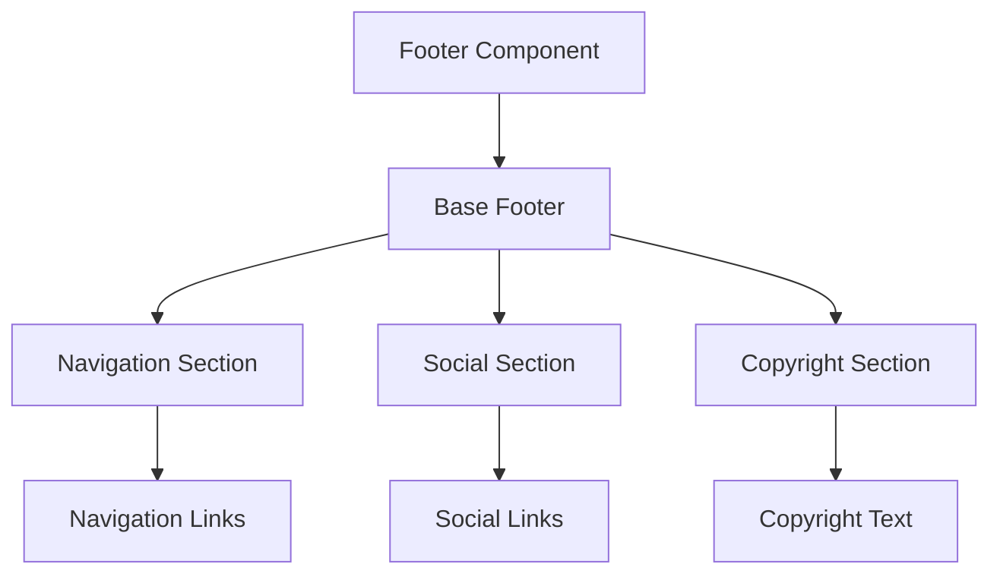
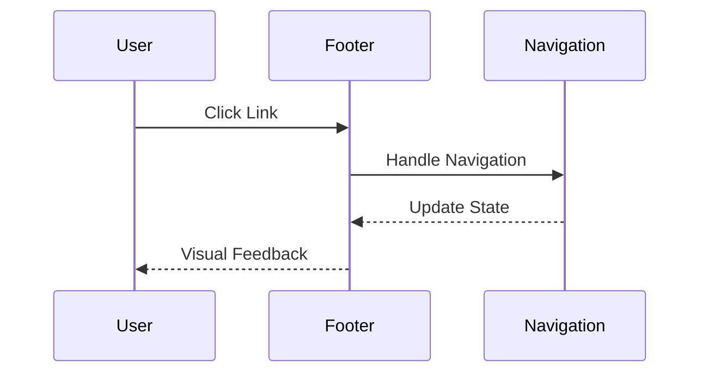
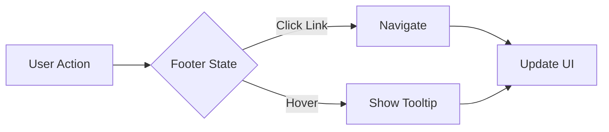

# Footer Component

## Overview
The Footer component provides a responsive application footer with navigation links, social media links, copyright information, and customizable styling. It follows ThriveSend's design system and includes comprehensive accessibility features.

## Screenshots

*Different footer states and configurations*

## Component Architecture


## Data Flow


## Features
- Responsive design
- Navigation links
- Social media integration
- Copyright information
- Custom theming
- Keyboard navigation
- Full accessibility support
- TypeScript type safety
- Performance optimized

## Props
| Prop | Type | Default | Description |
|------|------|---------|-------------|
| navigation | FooterNavigation[] | [] | Navigation links |
| socialLinks | SocialLink[] | [] | Social media links |
| copyright | string | "© 2025 ThriveSend" | Copyright text |
| className | string | undefined | Additional CSS classes |

## Usage
```typescript
import { Footer } from '@/components/layout/Footer';

// Basic footer
<Footer />

// Footer with navigation
<Footer
  navigation={[
    { label: 'About', href: '/about' },
    { label: 'Contact', href: '/contact' },
    { label: 'Privacy', href: '/privacy' }
  ]}
/>

// Footer with all features
<Footer
  navigation={navigationLinks}
  socialLinks={socialMediaLinks}
  copyright="© 2025 ThriveSend. All rights reserved."
  className="custom-footer"
/>
```

## User Interaction Workflow


## Components
1. **Base Footer**
   - Manages footer state
   - Handles responsive behavior
   - Implements accessibility features

2. **Navigation Section**
   - Displays navigation links
   - Handles link interactions
   - Manages layout

3. **Social Section**
   - Displays social media links
   - Handles external links
   - Manages icons

4. **Copyright Section**
   - Displays copyright text
   - Handles dynamic year
   - Manages styling

## Data Models
```typescript
interface FooterProps {
  navigation?: FooterNavigation[];
  socialLinks?: SocialLink[];
  copyright?: string;
  className?: string;
}

interface FooterNavigation {
  label: string;
  href: string;
  external?: boolean;
}

interface SocialLink {
  platform: 'twitter' | 'linkedin' | 'facebook' | 'instagram';
  url: string;
  label: string;
}

interface FooterState {
  hoveredLink: string | null;
}
```

## Styling
- Uses Tailwind CSS for styling
- Follows design system color tokens
- Implements consistent spacing
- Supports dark mode
- Maintains accessibility contrast ratios
- Responsive design patterns
- Smooth transitions

## Accessibility
- ARIA roles and attributes
- Keyboard navigation
- Focus management
- Color contrast compliance
- Screen reader support
- Link accessibility
- Semantic HTML structure

## Error Handling
- Invalid link handling
- External link handling
- Error boundary implementation
- Fallback content
- Loading states
- Error states

## Performance Optimizations
- Memoized callbacks
- CSS-in-JS optimization
- Event handler optimization
- State management optimization
- Render optimization

## Dependencies
- React
- TypeScript
- Tailwind CSS
- Lucide React (icons)
- Custom UI components

## Related Components
- [Header](./Header.md)
- [Sidebar](./Sidebar.md)
- [Button](../ui/Button.md)
- [Link](../ui/Link.md)

## Examples
### Basic Footer
```typescript
import { Footer } from '@/components/layout/Footer';

function AppFooter() {
  return <Footer />;
}
```

### Footer with Navigation
```typescript
import { Footer } from '@/components/layout/Footer';

function AppFooter() {
  const navigation = [
    { label: 'About', href: '/about' },
    { label: 'Contact', href: '/contact' },
    { label: 'Privacy', href: '/privacy' }
  ];

  return (
    <Footer
      navigation={navigation}
    />
  );
}
```

### Footer with Social Links
```typescript
import { Footer } from '@/components/layout/Footer';

function AppFooter() {
  const socialLinks = [
    {
      platform: 'twitter',
      url: 'https://twitter.com/thrivesend',
      label: 'Follow us on Twitter'
    },
    {
      platform: 'linkedin',
      url: 'https://linkedin.com/company/thrivesend',
      label: 'Connect on LinkedIn'
    }
  ];

  return (
    <Footer
      socialLinks={socialLinks}
    />
  );
}
```

## Best Practices
1. Keep footer content organized
2. Use clear, descriptive link labels
3. Implement proper external link handling
4. Handle responsive behavior
5. Follow accessibility guidelines
6. Use TypeScript for type safety
7. Optimize performance
8. Maintain consistent styling

## Troubleshooting
### Common Issues
1. **Links not working**
   - Check href values
   - Verify link handling
   - Check event handling

2. **Social icons not displaying**
   - Verify icon imports
   - Check platform names
   - Validate URLs

3. **Styling issues**
   - Check className usage
   - Verify Tailwind classes
   - Check for style conflicts

### Solutions
1. **Link Issues**
   ```typescript
   // Proper link implementation
   <Footer
     navigation={[
       {
         label: 'About',
         href: '/about',
         external: false
       }
     ]}
   />
   ```

2. **Social Link Issues**
   ```typescript
   // Proper social link implementation
   <Footer
     socialLinks={[
       {
         platform: 'twitter',
         url: 'https://twitter.com/thrivesend',
         label: 'Twitter'
       }
     ]}
   />
   ```

3. **Styling Issues**
   ```typescript
   // Proper styling implementation
   <Footer
     className="custom-footer bg-primary"
   />
   ```

## Contributing
When contributing to the Footer component:
1. Follow TypeScript best practices
2. Maintain accessibility standards
3. Add appropriate tests
4. Update documentation
5. Follow component guidelines

*Last Updated: 2025-06-04*
*Version: 1.0.0* 