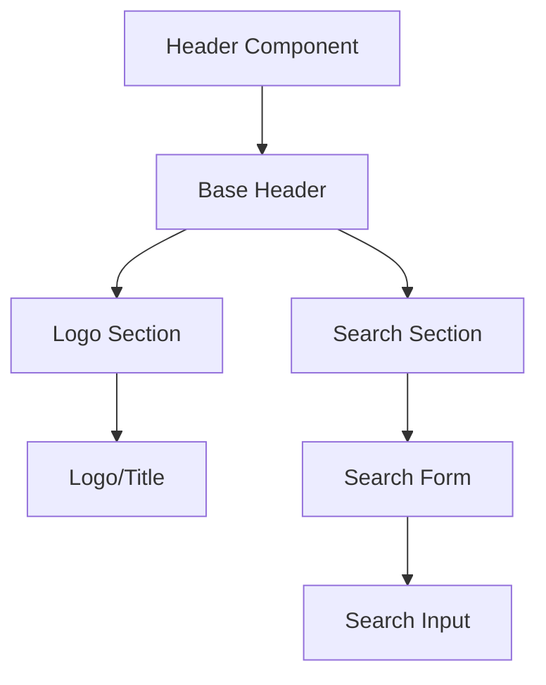
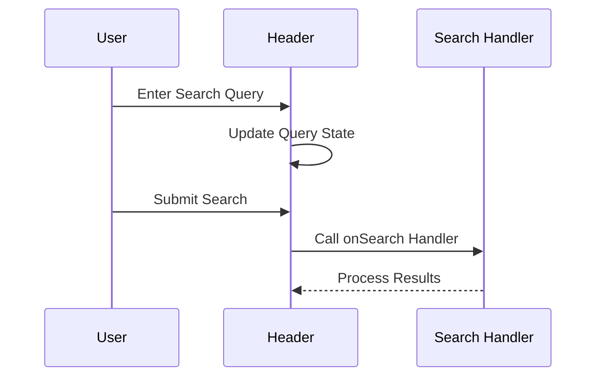
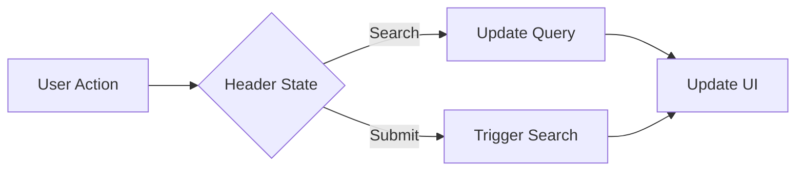

# Header Component

## Overview
The Header component provides a responsive application header with logo display, search functionality, and customizable styling. It follows ThriveSend's design system and includes comprehensive accessibility features.

## Screenshots

*Different header states and configurations*

## Component Architecture


## Data Flow


## Features
- Responsive design
- Logo/title display
- Search functionality
- Custom theming
- Keyboard navigation
- Full accessibility support
- TypeScript type safety
- Performance optimized

## Props
| Prop | Type | Default | Description |
|------|------|---------|-------------|
| logo | ReactNode | undefined | Custom logo component |
| onSearch | (query: string) => void | undefined | Search handler function |
| className | string | undefined | Additional CSS classes |

## Usage
```typescript
import { Header } from '@/components/layout/Header';

// Basic header
<Header />

// Header with custom logo
<Header logo={<CustomLogo />} />

// Header with search
<Header 
  onSearch={(query) => handleSearch(query)}
/>

// Header with all features
<Header
  logo={<CustomLogo />}
  onSearch={(query) => handleSearch(query)}
  className="custom-header"
/>
```

## User Interaction Workflow


## Components
1. **Base Header**
   - Manages header state
   - Handles responsive behavior
   - Implements accessibility features

2. **Logo Section**
   - Displays logo or title
   - Handles branding
   - Manages layout

3. **Search Section**
   - Manages search form
   - Handles input state
   - Processes search submission

## Data Models
```typescript
interface HeaderProps {
  logo?: React.ReactNode;
  onSearch?: (query: string) => void;
  className?: string;
}

interface HeaderState {
  query: string;
}
```

## Styling
- Uses Tailwind CSS for styling
- Follows design system color tokens
- Implements consistent spacing
- Supports dark mode
- Maintains accessibility contrast ratios
- Responsive design patterns
- Smooth transitions

## Accessibility
- ARIA roles and attributes
- Keyboard navigation
- Focus management
- Color contrast compliance
- Screen reader support
- Search form accessibility
- Semantic HTML structure

## Error Handling
- Invalid search handling
- Missing logo handling
- Error boundary implementation
- Fallback content
- Loading states
- Error states

## Performance Optimizations
- Memoized callbacks
- CSS-in-JS optimization
- Event handler optimization
- State management optimization
- Render optimization

## Dependencies
- React
- TypeScript
- Tailwind CSS
- Lucide React (icons)
- Custom UI components

## Related Components
- [Sidebar](./Sidebar.md)
- [Footer](./Footer.md)
- [Input](../ui/Input.md)
- [Button](../ui/Button.md)

## Examples
### Basic Header
```typescript
import { Header } from '@/components/layout/Header';

function AppHeader() {
  return <Header />;
}
```

### Header with Search
```typescript
import { Header } from '@/components/layout/Header';

function AppHeader() {
  const handleSearch = (query: string) => {
    // Implement search logic
    console.log('Searching for:', query);
  };

  return (
    <Header
      onSearch={handleSearch}
    />
  );
}
```

### Custom Styling
```typescript
import { Header } from '@/components/layout/Header';

function AppHeader() {
  return (
    <Header
      className="bg-primary-900 text-white"
      logo={<CustomLogo />}
    />
  );
}
```

## Best Practices
1. Keep header content minimal
2. Use clear, recognizable logo
3. Implement proper search handling
4. Handle responsive behavior
5. Follow accessibility guidelines
6. Use TypeScript for type safety
7. Optimize performance
8. Maintain consistent styling

## Troubleshooting
### Common Issues
1. **Search not working**
   - Check onSearch handler
   - Verify form submission
   - Check event handling

2. **Logo not displaying**
   - Verify logo component
   - Check component rendering
   - Validate props

3. **Styling issues**
   - Check className usage
   - Verify Tailwind classes
   - Check for style conflicts

### Solutions
1. **Search Issues**
   ```typescript
   // Proper search implementation
   <Header
     onSearch={(query) => {
       // Implement search logic
       console.log('Searching for:', query);
     }}
   />
   ```

2. **Logo Issues**
   ```typescript
   // Proper logo implementation
   <Header
     logo={}
   />
   ```

3. **Styling Issues**
   ```typescript
   // Proper styling implementation
   <Header
     className="custom-header bg-primary"
   />
   ```

## Contributing
When contributing to the Header component:
1. Follow TypeScript best practices
2. Maintain accessibility standards
3. Add appropriate tests
4. Update documentation
5. Follow component guidelines

*Last Updated: 2025-06-04*
*Version: 1.0.0* 