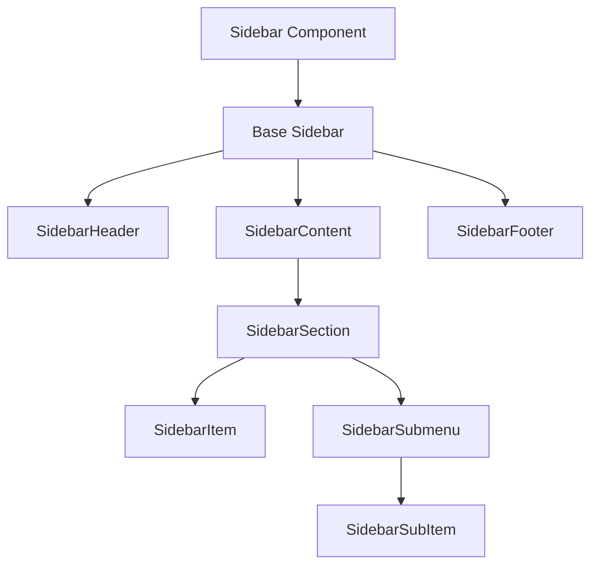
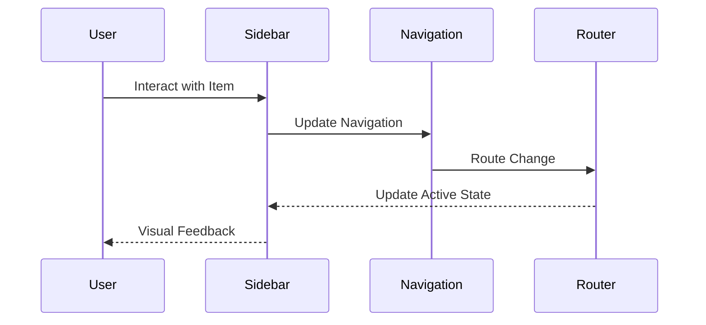
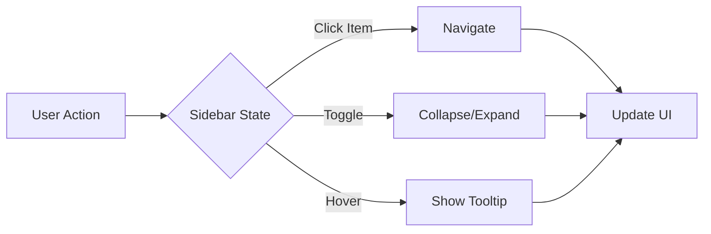

# Sidebar Component

## Overview
The Sidebar component provides a responsive navigation sidebar with collapsible sections, nested menus, and customizable styling. It follows ThriveSend's design system and includes comprehensive accessibility features.

## Screenshots

*Different sidebar states and configurations*

## Component Architecture


## Data Flow


## Features
- Responsive design
- Collapsible sections
- Nested navigation
- Active state tracking
- Custom theming
- Keyboard navigation
- Full accessibility support
- TypeScript type safety
- Performance optimized

## Props
| Prop | Type | Default | Description |
|------|------|---------|-------------|
| variant | 'default' \| 'compact' \| 'expanded' | 'default' | Sidebar style variant |
| collapsed | boolean | false | Collapsed state |
| onCollapse | (collapsed: boolean) => void | undefined | Collapse handler |
| items | SidebarItem[] | [] | Navigation items |
| activeItem | string | undefined | Active item ID |
| className | string | undefined | Additional CSS classes |
| logo | ReactNode | undefined | Logo component |
| footer | ReactNode | undefined | Footer content |

## Usage
```typescript
import { Sidebar } from '@/components/layout/Sidebar';

// Basic sidebar
<Sidebar
  items={[
    { id: 'dashboard', label: 'Dashboard', icon: <DashboardIcon /> },
    { id: 'content', label: 'Content', icon: <ContentIcon /> },
    { id: 'analytics', label: 'Analytics', icon: <AnalyticsIcon /> }
  ]}
/>

// Collapsible sidebar
<Sidebar
  variant="compact"
  collapsed={isCollapsed}
  onCollapse={setCollapsed}
  items={navigationItems}
/>

// Nested navigation
<Sidebar
  items={[
    {
      id: 'content',
      label: 'Content',
      icon: <ContentIcon />,
      items: [
        { id: 'posts', label: 'Posts' },
        { id: 'pages', label: 'Pages' }
      ]
    }
  ]}
/>
```

## User Interaction Workflow


## Components
1. **Base Sidebar**
   - Manages sidebar state
   - Handles responsive behavior
   - Implements accessibility features

2. **SidebarHeader**
   - Displays logo
   - Manages collapse button
   - Handles branding

3. **SidebarContent**
   - Manages navigation items
   - Handles scrolling
   - Implements section management

4. **SidebarFooter**
   - Displays footer content
   - Manages user profile
   - Handles actions

5. **SidebarSection**
   - Groups related items
   - Manages section state
   - Handles animations

6. **SidebarItem**
   - Displays navigation item
   - Handles interactions
   - Manages active state

7. **SidebarSubmenu**
   - Manages nested items
   - Handles expansion
   - Implements animations

## Data Models
```typescript
interface SidebarProps {
  variant?: 'default' | 'compact' | 'expanded';
  collapsed?: boolean;
  onCollapse?: (collapsed: boolean) => void;
  items: SidebarItem[];
  activeItem?: string;
  className?: string;
  logo?: ReactNode;
  footer?: ReactNode;
}

interface SidebarItem {
  id: string;
  label: string;
  icon?: ReactNode;
  items?: SidebarItem[];
  href?: string;
  onClick?: () => void;
  badge?: string | number;
  disabled?: boolean;
}

interface SidebarState {
  collapsed: boolean;
  activeItem: string | null;
  expandedSections: string[];
  hoveredItem: string | null;
}
```

## Styling
- Uses Tailwind CSS for styling
- Follows design system color tokens
- Implements consistent spacing
- Supports dark mode
- Maintains accessibility contrast ratios
- Responsive design patterns
- Smooth transitions

## Accessibility
- ARIA roles and attributes
- Keyboard navigation
- Focus management
- Color contrast compliance
- Screen reader support
- Collapse/expand announcements
- Active state indicators

## Error Handling
- Invalid route handling
- Missing item handling
- Error boundary implementation
- Fallback content
- Loading states
- Error states

## Performance Optimizations
- Virtualized item list
- Lazy loading
- Memoized callbacks
- CSS-in-JS optimization
- Transition optimizations
- Event handler optimization

## Dependencies
- React
- TypeScript
- Tailwind CSS
- React Router
- React Icons
- Framer Motion (optional)

## Related Components
- [Header](./Header.md)
- [Footer](./Footer.md)
- [Menu](../navigation/Menu.md)

## Examples
### Basic Navigation
```typescript
import { Sidebar } from '@/components/layout/Sidebar';

function AppSidebar() {
  const items = [
    { id: 'dashboard', label: 'Dashboard', icon: <DashboardIcon /> },
    { id: 'content', label: 'Content', icon: <ContentIcon /> },
    { id: 'analytics', label: 'Analytics', icon: <AnalyticsIcon /> }
  ];

  return <Sidebar items={items} />;
}
```

### Nested Navigation
```typescript
import { Sidebar } from '@/components/layout/Sidebar';

function AppSidebar() {
  const items = [
    {
      id: 'content',
      label: 'Content',
      icon: <ContentIcon />,
      items: [
        { id: 'posts', label: 'Posts' },
        { id: 'pages', label: 'Pages' },
        { id: 'media', label: 'Media' }
      ]
    },
    {
      id: 'settings',
      label: 'Settings',
      icon: <SettingsIcon />,
      items: [
        { id: 'profile', label: 'Profile' },
        { id: 'security', label: 'Security' }
      ]
    }
  ];

  return <Sidebar items={items} />;
}
```

### Custom Styling
```typescript
import { Sidebar } from '@/components/layout/Sidebar';

function AppSidebar() {
  return (
    <Sidebar
      variant="expanded"
      className="bg-primary-900 text-white"
      logo={<CustomLogo />}
      footer={<UserProfile />}
    />
  );
}
```

## Best Practices
1. Keep navigation items organized
2. Use clear, concise labels
3. Include appropriate icons
4. Implement proper routing
5. Handle responsive behavior
6. Follow accessibility guidelines
7. Use TypeScript for type safety
8. Optimize performance

## Troubleshooting
### Common Issues
1. **Navigation not working**
   - Check route configuration
   - Verify item structure
   - Check event handlers

2. **Collapse not working**
   - Verify collapsed prop
   - Check onCollapse handler
   - Validate state management

3. **Styling issues**
   - Check variant prop
   - Verify className usage
   - Check for style conflicts

### Solutions
1. **Navigation Issues**
   ```typescript
   // Proper navigation setup
   <Sidebar
     items={[
       {
         id: 'dashboard',
         label: 'Dashboard',
         href: '/dashboard'
       }
     ]}
   />
   ```

2. **Collapse Issues**
   ```typescript
   // Proper collapse implementation
   const [collapsed, setCollapsed] = useState(false);
   
   <Sidebar
     collapsed={collapsed}
     onCollapse={setCollapsed}
     items={items}
   />
   ```

3. **Styling Issues**
   ```typescript
   // Proper styling implementation
   <Sidebar
     variant="expanded"
     className="custom-sidebar"
     items={items}
   />
   ```

## Contributing
When contributing to the Sidebar component:
1. Follow TypeScript best practices
2. Maintain accessibility standards
3. Add appropriate tests
4. Update documentation
5. Follow component guidelines

*Last Updated: 2025-06-04*
*Version: 1.0.0* 