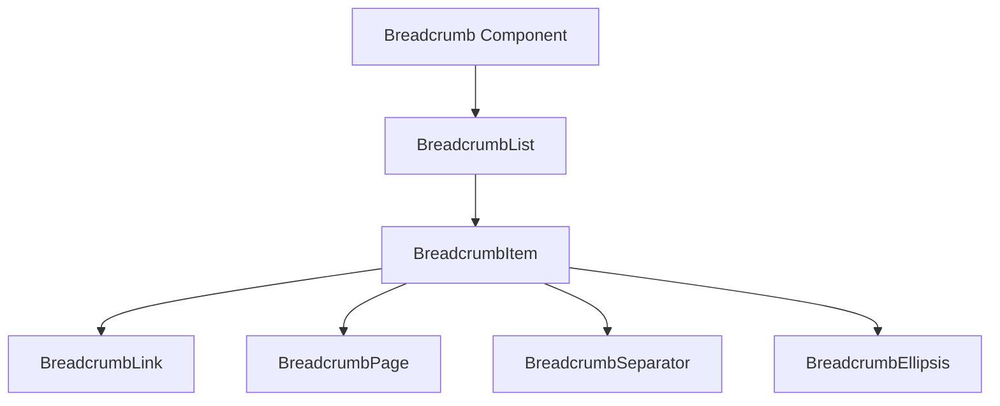
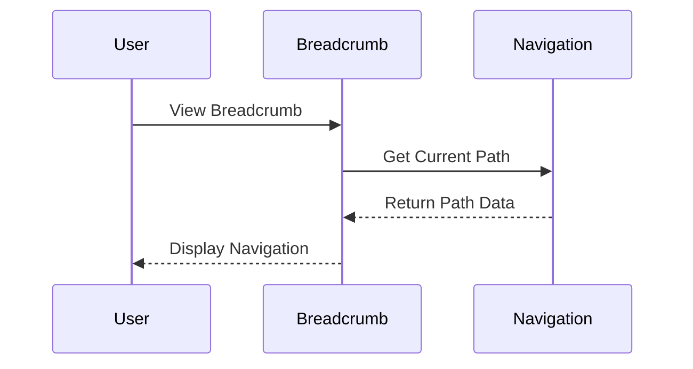
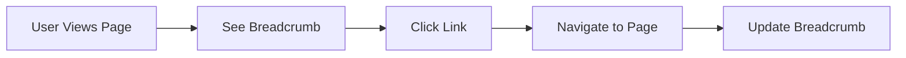

# Breadcrumb Component

## Overview
The Breadcrumb component is a navigation component that displays the current page's location within a website's hierarchy. It provides users with a clear path to navigate back to higher-level pages and understand their current location in the application structure.

## Screenshots

*Different Breadcrumb states and configurations*

## Component Architecture


## Data Flow


## Features
- Hierarchical navigation display
- Responsive design
- Accessibility support
- Customizable separators
- Ellipsis for long paths
- TypeScript type safety
- Keyboard navigation
- Screen reader support

## Props
| Component | Props | Type | Default | Description |
|-----------|-------|------|---------|-------------|
| Breadcrumb | - | HTMLAttributes | - | Root navigation element |
| BreadcrumbList | className | string | - | Ordered list container |
| BreadcrumbItem | className | string | - | List item wrapper |
| BreadcrumbLink | asChild, className | boolean, string | false, - | Clickable link element |
| BreadcrumbPage | className | string | - | Current page indicator |
| BreadcrumbSeparator | children, className | ReactNode, string | ChevronRight | Path separator |
| BreadcrumbEllipsis | className | string | - | Overflow indicator |

## Usage
```typescript
import {
  Breadcrumb,
  BreadcrumbList,
  BreadcrumbItem,
  BreadcrumbLink,
  BreadcrumbPage,
  BreadcrumbSeparator,
} from "@/components/ui/breadcrumb"

// Basic usage
<Breadcrumb>
  <BreadcrumbList>
    <BreadcrumbItem>
      <BreadcrumbLink href="/">Home</BreadcrumbLink>
    </BreadcrumbItem>
    <BreadcrumbSeparator />
    <BreadcrumbItem>
      <BreadcrumbLink href="/projects">Projects</BreadcrumbLink>
    </BreadcrumbItem>
    <BreadcrumbSeparator />
    <BreadcrumbItem>
      <BreadcrumbPage>Current Project</BreadcrumbPage>
    </BreadcrumbItem>
  </BreadcrumbList>
</Breadcrumb>

// With custom separator
<Breadcrumb>
  <BreadcrumbList>
    <BreadcrumbItem>
      <BreadcrumbLink href="/">Home</BreadcrumbLink>
    </BreadcrumbItem>
    <BreadcrumbSeparator>/</BreadcrumbSeparator>
    <BreadcrumbItem>
      <BreadcrumbPage>Current Page</BreadcrumbPage>
    </BreadcrumbItem>
  </BreadcrumbList>
</Breadcrumb>

// With ellipsis
<Breadcrumb>
  <BreadcrumbList>
    <BreadcrumbItem>
      <BreadcrumbLink href="/">Home</BreadcrumbLink>
    </BreadcrumbItem>
    <BreadcrumbSeparator />
    <BreadcrumbItem>
      <BreadcrumbEllipsis />
    </BreadcrumbItem>
    <BreadcrumbSeparator />
    <BreadcrumbItem>
      <BreadcrumbPage>Current Page</BreadcrumbPage>
    </BreadcrumbItem>
  </BreadcrumbList>
</Breadcrumb>
```

## User Interaction Workflow


## Components
1. **Breadcrumb**
   - Root navigation element
   - Provides ARIA context
   - Manages accessibility

2. **BreadcrumbList**
   - Ordered list container
   - Handles responsive layout
   - Manages spacing

3. **BreadcrumbItem**
   - List item wrapper
   - Manages item spacing
   - Handles item alignment

4. **BreadcrumbLink**
   - Clickable navigation
   - Handles hover states
   - Manages transitions

5. **BreadcrumbPage**
   - Current page indicator
   - Disables interaction
   - Shows active state

6. **BreadcrumbSeparator**
   - Path separator
   - Customizable icon
   - Maintains spacing

7. **BreadcrumbEllipsis**
   - Overflow indicator
   - Shows more items
   - Maintains accessibility

## Data Models
```typescript
interface BreadcrumbProps extends React.HTMLAttributes<HTMLElement> {}

interface BreadcrumbListProps extends React.OlHTMLAttributes<HTMLOListElement> {
  className?: string;
}

interface BreadcrumbItemProps extends React.LiHTMLAttributes<HTMLLIElement> {
  className?: string;
}

interface BreadcrumbLinkProps extends React.AnchorHTMLAttributes<HTMLAnchorElement> {
  asChild?: boolean;
  className?: string;
}

interface BreadcrumbPageProps extends React.HTMLAttributes<HTMLSpanElement> {
  className?: string;
}

interface BreadcrumbSeparatorProps extends React.HTMLAttributes<HTMLSpanElement> {
  children?: React.ReactNode;
  className?: string;
}

interface BreadcrumbEllipsisProps extends React.HTMLAttributes<HTMLSpanElement> {
  className?: string;
}
```

## Styling
- Uses Tailwind CSS
- Follows design system tokens
- Responsive breakpoints
- Consistent spacing
- Smooth transitions
- Dark mode support
- Accessibility contrast

## Accessibility
- ARIA labels and roles
- Keyboard navigation
- Screen reader support
- Focus management
- Semantic HTML
- Color contrast
- Interactive states

## Error Handling
- Invalid paths
- Missing links
- Overflow handling
- Edge cases
- Type checking
- Null checks

## Performance Optimizations
- Memoized components
- Minimal re-renders
- Efficient DOM updates
- Optimized transitions
- Lazy loading
- Bundle optimization

## Dependencies
- React
- TypeScript
- Radix UI
- Lucide Icons
- Tailwind CSS
- Custom utilities

## Related Components
- [Navigation](../layout/Navigation.md)
- [Sidebar](../layout/Sidebar.md)
- [Header](../layout/Header.md)
- [Footer](../layout/Footer.md)

## Examples
### Basic Navigation
```typescript
import {
  Breadcrumb,
  BreadcrumbList,
  BreadcrumbItem,
  BreadcrumbLink,
  BreadcrumbPage,
  BreadcrumbSeparator,
} from "@/components/ui/breadcrumb"

function BasicBreadcrumb() {
  return (
    <Breadcrumb>
      <BreadcrumbList>
        <BreadcrumbItem>
          <BreadcrumbLink href="/">Home</BreadcrumbLink>
        </BreadcrumbItem>
        <BreadcrumbSeparator />
        <BreadcrumbItem>
          <BreadcrumbPage>Current Page</BreadcrumbPage>
        </BreadcrumbItem>
      </BreadcrumbList>
    </Breadcrumb>
  )
}
```

### Dynamic Navigation
```typescript
import {
  Breadcrumb,
  BreadcrumbList,
  BreadcrumbItem,
  BreadcrumbLink,
  BreadcrumbPage,
  BreadcrumbSeparator,
} from "@/components/ui/breadcrumb"

function DynamicBreadcrumb({ path }: { path: string[] }) {
  return (
    <Breadcrumb>
      <BreadcrumbList>
        <BreadcrumbItem>
          <BreadcrumbLink href="/">Home</BreadcrumbLink>
        </BreadcrumbItem>
        {path.map((segment, index) => (
          <React.Fragment key={segment}>
            <BreadcrumbSeparator />
            <BreadcrumbItem>
              {index === path.length - 1 ? (
                <BreadcrumbPage>{segment}</BreadcrumbPage>
              ) : (
                <BreadcrumbLink href={`/${path.slice(0, index + 1).join('/')}`}>
                  {segment}
                </BreadcrumbLink>
              )}
            </BreadcrumbItem>
          </React.Fragment>
        ))}
      </BreadcrumbList>
    </Breadcrumb>
  )
}
```

### With Custom Styling
```typescript
import {
  Breadcrumb,
  BreadcrumbList,
  BreadcrumbItem,
  BreadcrumbLink,
  BreadcrumbPage,
  BreadcrumbSeparator,
} from "@/components/ui/breadcrumb"

function CustomBreadcrumb() {
  return (
    <Breadcrumb className="custom-breadcrumb">
      <BreadcrumbList className="custom-list">
        <BreadcrumbItem>
          <BreadcrumbLink 
            href="/"
            className="custom-link"
          >
            Home
          </BreadcrumbLink>
        </BreadcrumbItem>
        <BreadcrumbSeparator className="custom-separator">
          /
        </BreadcrumbSeparator>
        <BreadcrumbItem>
          <BreadcrumbPage className="custom-page">
            Current Page
          </BreadcrumbPage>
        </BreadcrumbItem>
      </BreadcrumbList>
    </Breadcrumb>
  )
}
```

## Best Practices
1. Keep paths concise
2. Use clear labels
3. Maintain hierarchy
4. Ensure accessibility
5. Handle edge cases
6. Optimize performance
7. Follow design system
8. Test thoroughly

## Troubleshooting
### Common Issues
1. **Navigation not working**
   - Check href values
   - Verify routing setup
   - Check event handlers

2. **Styling issues**
   - Check className usage
   - Verify Tailwind classes
   - Check custom styles

3. **Accessibility issues**
   - Verify ARIA attributes
   - Check keyboard navigation
   - Test screen readers

### Solutions
1. **Navigation Issues**
   ```typescript
   // Proper routing setup
   <BreadcrumbLink href="/correct/path">
     Correct Path
   </BreadcrumbLink>
   ```

2. **Styling Issues**
   ```typescript
   // Proper styling implementation
   <Breadcrumb className="custom-breadcrumb">
     <BreadcrumbList className="flex items-center">
       {/* ... */}
     </BreadcrumbList>
   </Breadcrumb>
   ```

3. **Accessibility Issues**
   ```typescript
   // Proper accessibility setup
   <Breadcrumb aria-label="Navigation">
     <BreadcrumbList role="list">
       <BreadcrumbItem role="listitem">
         {/* ... */}
       </BreadcrumbItem>
     </BreadcrumbList>
   </Breadcrumb>
   ```

## Contributing
When contributing to the Breadcrumb component:
1. Follow TypeScript best practices
2. Maintain accessibility standards
3. Add appropriate tests
4. Update documentation
5. Follow component guidelines

*Last Updated: 2025-06-04*
*Version: 1.0.0* 