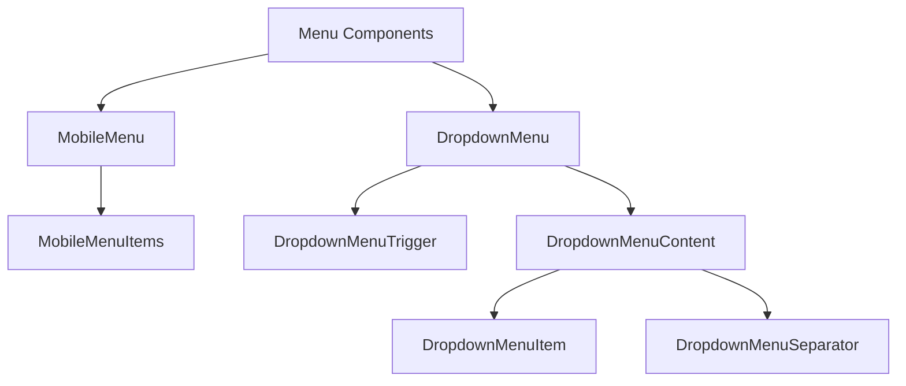
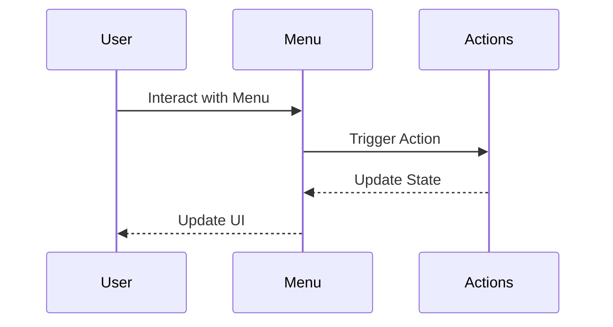
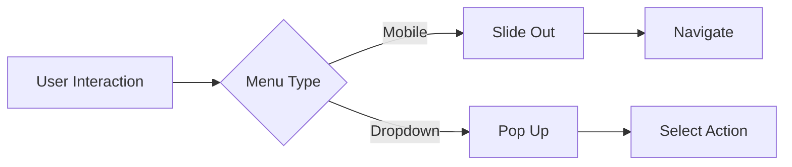

# Menu Component

## Overview
The Menu component in ThriveSend provides two main implementations: MobileMenu for responsive navigation and DropdownMenu for contextual actions. Both implementations follow ThriveSend's design system and accessibility guidelines.

## Screenshots

*Mobile menu in open state*


*Dropdown menu with actions*

## Component Architecture


## Data Flow


## Features
- Responsive mobile navigation
- Contextual dropdown menus
- Keyboard navigation
- Screen reader support
- Touch-friendly interactions
- Dark mode support
- Customizable styling
- TypeScript type safety
- Accessibility compliance
- Animation support

## Props

### MobileMenu Props
```typescript
interface MobileMenuProps {
  open: boolean;
  onClose: () => void;
}
```

### DropdownMenu Props
```typescript
interface DropdownMenuProps {
  children: React.ReactNode;
  defaultOpen?: boolean;
  open?: boolean;
  onOpenChange?: (open: boolean) => void;
  modal?: boolean;
  dir?: 'ltr' | 'rtl';
}
```

## Usage

### MobileMenu
```typescript
import { MobileMenu } from "@/components/dashboard/MobileMenu"

function App() {
  const [isOpen, setIsOpen] = React.useState(false);

  return (
    <MobileMenu
      open={isOpen}
      onClose={() => setIsOpen(false)}
    />
  );
}
```

### DropdownMenu
```typescript
import {
  DropdownMenu,
  DropdownMenuTrigger,
  DropdownMenuContent,
  DropdownMenuItem,
  DropdownMenuSeparator,
} from "@/components/ui/dropdown-menu"

function ActionsMenu() {
  return (
    <DropdownMenu>
      <DropdownMenuTrigger>
        Actions
      </DropdownMenuTrigger>
      <DropdownMenuContent>
        <DropdownMenuItem>Edit</DropdownMenuItem>
        <DropdownMenuItem>Duplicate</DropdownMenuItem>
        <DropdownMenuSeparator />
        <DropdownMenuItem>Delete</DropdownMenuItem>
      </DropdownMenuContent>
    </DropdownMenu>
  );
}
```

## User Interaction Workflow


## Components

### 1. MobileMenu
- Slide-out navigation panel
- Backdrop overlay
- Responsive design
- Touch-friendly
- Keyboard accessible

### 2. DropdownMenu
- Contextual menu
- Position-aware
- Keyboard navigation
- Focus management
- Animation support

## Data Models
```typescript
interface MenuItem {
  label: string;
  href: string;
  icon?: string;
}

interface DropdownMenuItemProps {
  children: React.ReactNode;
  disabled?: boolean;
  onSelect?: (event: Event) => void;
}
```

## Styling
- Tailwind CSS
- Design system tokens
- Responsive breakpoints
- Dark mode support
- Animation classes
- Focus states
- Hover effects

## Accessibility
- ARIA labels
- Keyboard navigation
- Focus management
- Screen reader support
- Touch targets
- Color contrast
- Semantic HTML

## Error Handling
- Invalid states
- Edge cases
- Type checking
- Null checks
- Event handling
- State management

## Performance Optimizations
- Memoized components
- Lazy loading
- Event delegation
- State updates
- Animation performance
- Bundle size

## Dependencies
- React
- TypeScript
- Tailwind CSS
- Radix UI
- Framer Motion

## Related Components
- [Breadcrumb](./Breadcrumb.md)
- [Pagination](./Pagination.md)
- [Sidebar](../layout/Sidebar.md)

## Examples

### Mobile Navigation
```typescript
import { MobileMenu } from "@/components/dashboard/MobileMenu"

function Navigation() {
  const [isOpen, setIsOpen] = React.useState(false);

  return (
    <>
      <button onClick={() => setIsOpen(true)}>
        Open Menu
      </button>
      <MobileMenu
        open={isOpen}
        onClose={() => setIsOpen(false)}
      />
    </>
  );
}
```

### Context Menu
```typescript
import {
  DropdownMenu,
  DropdownMenuTrigger,
  DropdownMenuContent,
  DropdownMenuItem,
} from "@/components/ui/dropdown-menu"

function ContextMenu() {
  return (
    <DropdownMenu>
      <DropdownMenuTrigger>
        <button>More Actions</button>
      </DropdownMenuTrigger>
      <DropdownMenuContent>
        <DropdownMenuItem>View Details</DropdownMenuItem>
        <DropdownMenuItem>Edit</DropdownMenuItem>
        <DropdownMenuItem>Delete</DropdownMenuItem>
      </DropdownMenuContent>
    </DropdownMenu>
  );
}
```

## Best Practices
1. Use semantic HTML
2. Implement keyboard navigation
3. Add ARIA labels
4. Handle focus management
5. Support touch interactions
6. Follow design system
7. Optimize performance
8. Test accessibility

## Troubleshooting

### Common Issues
1. **Menu not opening**
   - Check state management
   - Verify event handlers
   - Check z-index values

2. **Accessibility issues**
   - Verify ARIA attributes
   - Test keyboard navigation
   - Check focus management

3. **Styling problems**
   - Check Tailwind classes
   - Verify dark mode
   - Check responsive design

### Solutions
1. **State Management**
   ```typescript
   // Proper state handling
   const [isOpen, setIsOpen] = React.useState(false);
   const handleClose = () => setIsOpen(false);
   ```

2. **Accessibility**
   ```typescript
   // Proper accessibility setup
   <nav aria-label="Navigation menu">
     <button aria-expanded={isOpen}>
       Menu
     </button>
   </nav>
   ```

3. **Styling**
   ```typescript
   // Proper styling implementation
   <div className="fixed inset-0 z-40 bg-black/50">
     <nav className="fixed top-0 left-0 h-full w-[280px]">
       {/* Menu content */}
     </nav>
   </div>
   ```

## Contributing
When contributing to the Menu components:
1. Follow TypeScript best practices
2. Maintain accessibility standards
3. Add appropriate tests
4. Update documentation
5. Follow component guidelines

*Last Updated: 2025-06-04*
*Version: 1.0.0* 