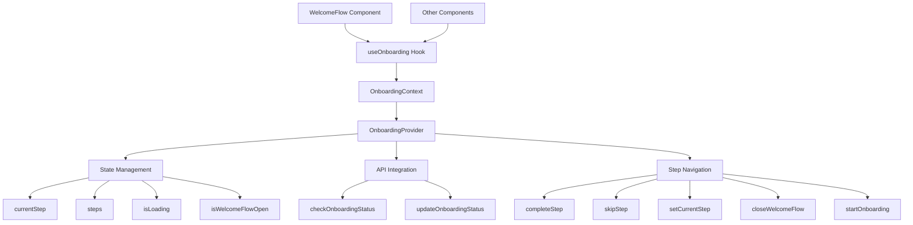
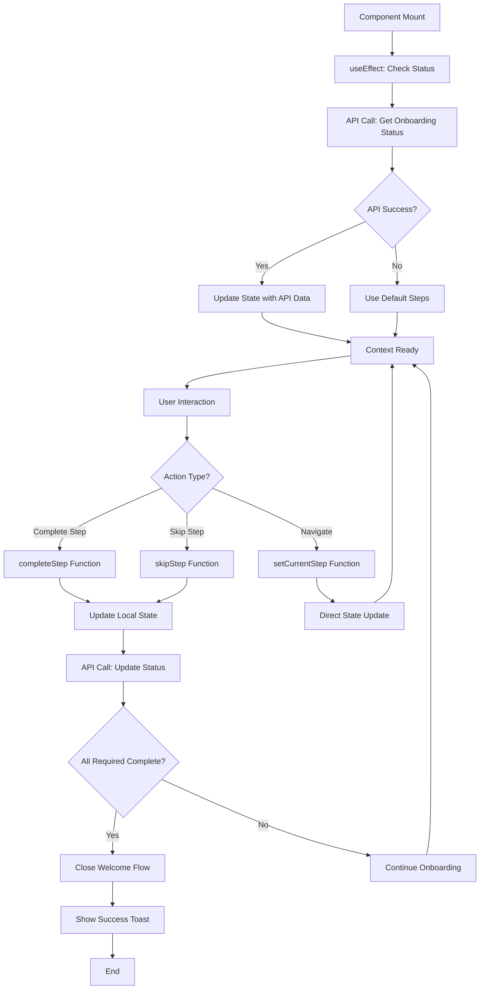
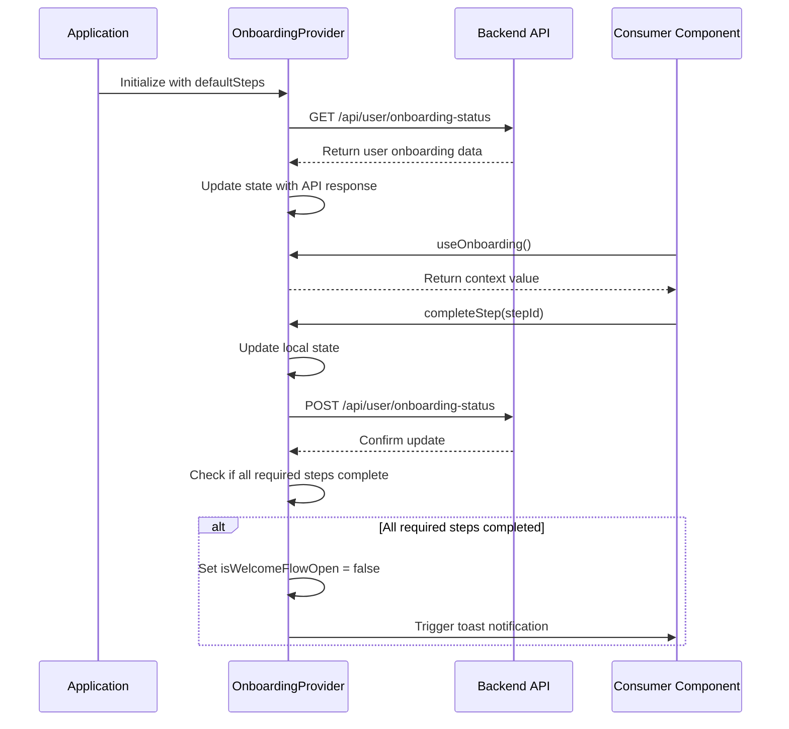
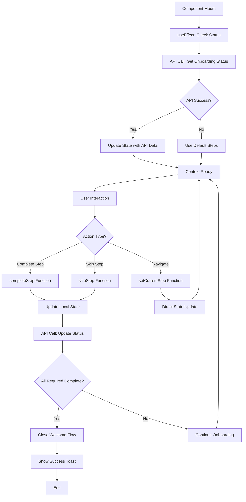

# OnboardingContext Documentation

## Overview

The `OnboardingContext` provides a centralized state management system for the user onboarding flow in ThriveSend. It manages onboarding steps, tracks completion status, and handles API interactions for persisting onboarding progress.

## Screenshots

*Note: Screenshots will be added when the component is fully implemented and tested.*

## Architecture

### Component Structure


## Data Flow


### State Management Flow


### Key Features

- Centralized State Management : Single source of truth for onboarding progress
- Persistent Progress : Automatic saving of step completion to backend
- Step Navigation : Forward/backward navigation through onboarding steps
- Conditional Logic : Smart step skipping based on user preferences
- Real-time Updates : Immediate UI updates on step completion
- Error Handling : Graceful handling of API failures
- Toast Notifications : User feedback on important actions
- Welcome Flow Control : Automatic closure when onboarding is complete

# Implementation Details
## Context Interface

```typescript
interface OnboardingStep {
  id: string;
  title: string;
  description: string;
  completed: boolean;
  required: boolean;
  order: number;
}

interface OnboardingContextType {
  currentStep: number;
  steps: OnboardingStep[];
  isLoading: boolean;
  isWelcomeFlowOpen: boolean;
  completeStep: (stepId: string) => Promise<void>;
  skipStep: (stepId: string) => Promise<void>;
  setCurrentStep: (step: number) => void;
  closeWelcomeFlow: () => void;
  startOnboarding: () => void;
}
```
# Default Steps Configuration
```typescript
const defaultSteps: OnboardingStep[] = [
  {
    id: 'welcome',
    title: 'Welcome to ThriveSend',
    description: 'Get started with your content marketing journey',
    completed: false,
    required: true,
    order: 1
  },
  {
    id: 'profile',
    title: 'Complete Your Profile',
    description: 'Add your business information and preferences',
    completed: false,
    required: true,
    order: 2
  },
  {
    id: 'first-campaign',
    title: 'Create Your First Campaign',
    description: 'Set up your first marketing campaign',
    completed: false,
    required: false,
    order: 3
  },
  {
    id: 'explore-features',
    title: 'Explore Key Features',
    description: 'Discover analytics, automation, and more',
    completed: false,
    required: false,
    order: 4
  }
];
```
# Usage Examples
## Basic Implementation
```tsx
import { OnboardingProvider } from '@/components/onboarding/OnboardingContext';
import { WelcomeFlow } from '@/components/onboarding/WelcomeFlow';

function App() {
  return (
    <OnboardingProvider>
      <div className="app">
        <WelcomeFlow />
        {/* Other app components */}
      </div>
    </OnboardingProvider>
  );
}
```
## Using the Hook
```tsx
import { useOnboarding } from '@/components/onboarding/OnboardingContext';

function OnboardingButton() {
  const { completeStep, currentStep, steps } = useOnboarding();
  
  const handleComplete = async () => {
    const currentStepData = steps[currentStep];
    await completeStep(currentStepData.id);
  };
  
  return (
    <button onClick={handleComplete}>
      Complete Step
    </button>
  );
}
```
## Custom Step Navigation 
```tsx
import { useOnboarding } from '@/components/onboarding/OnboardingContext';

function StepNavigator() {
  const { currentStep, setCurrentStep, steps } = useOnboarding();
  
  return (
    <div className="step-navigator">
      {steps.map((step, index) => (
        <button
          key={step.id}
          onClick={() => setCurrentStep(index)}
          className={`step-button ${
            index === currentStep ? 'active' : ''
          } ${
            step.completed ? 'completed' : ''
          }`}
        >
          {step.title}
        </button>
      ))}
    </div>
  );
}
```
## API Endpoints
### Get Onboarding Status
```typescript
// GET /api/user/onboarding-status
// Response:
{
  success: boolean;
  data: {
    currentStep: number;
    steps: OnboardingStep[];
    isWelcomeFlowOpen: boolean;
  };
}
```
## Update Onboarding Status
```typescript
// POST /api/user/onboarding-status
// Request:
{
  currentStep: number;
  steps: OnboardingStep[];
  isWelcomeFlowOpen: boolean;
}

// Response:
{
  success: boolean;
  message: string;
}
```
## Error Handling
### API Error Management
```typescript
const completeStep = async (stepId: string) => {
  try {
    setIsLoading(true);
    
    // Update local state optimistically
    const updatedSteps = steps.map(step => 
      step.id === stepId ? { ...step, completed: true } : step
    );
    setSteps(updatedSteps);
    
    // Persist to backend
    const response = await fetch('/api/user/onboarding-status', {
      method: 'POST',
      headers: { 'Content-Type': 'application/json' },
      body: JSON.stringify({ steps: updatedSteps })
    });
    
    if (!response.ok) {
      throw new Error('Failed to update onboarding status');
    }
    
    // Check if all required steps are completed
    const allRequiredCompleted = updatedSteps
      .filter(step => step.required)
      .every(step => step.completed);
      
    if (allRequiredCompleted) {
      setIsWelcomeFlowOpen(false);
      toast.success('Onboarding completed successfully!');
    }
    
  } catch (error) {
    // Revert optimistic update on error
    setSteps(prevSteps => 
      prevSteps.map(step => 
        step.id === stepId ? { ...step, completed: false } : step
      )
    );
    
    toast.error('Failed to update step. Please try again.');
    console.error('Onboarding step completion error:', error);
  } finally {
    setIsLoading(false);
  }
};
```
## Performance Considerations
### Optimistic Updates
- Local state updates immediately for better UX
- API calls happen in background
- Automatic rollback on API failures

## Memoization
```typescript
const contextValue = useMemo(() => ({
  currentStep,
  steps,
  isLoading,
  isWelcomeFlowOpen,
  completeStep,
  skipStep,
  setCurrentStep,
  closeWelcomeFlow,
  startOnboarding
}), [
  currentStep,
  steps,
  isLoading,
  isWelcomeFlowOpen
]);
```
### Debounced API Calls
- Prevent rapid successive API calls
- Batch multiple step updates when possible
## Testing Strategy
### Unit Tests
```tsx
describe('OnboardingContext', () => {
  test('completes step successfully', async () => {
    const { result } = renderHook(() => useOnboarding(), {
      wrapper: OnboardingProvider
    });
    
    await act(async () => {
      await result.current.completeStep('welcome');
    });
    
    expect(result.current.steps[0].completed).toBe(true);
  });
  
  test('handles API errors gracefully', async () => {
    // Mock API failure
    global.fetch = jest.fn().mockRejectedValue(new Error('API Error'));
    
    const { result } = renderHook(() => useOnboarding(), {
      wrapper: OnboardingProvider
    });
    
    await act(async () => {
      await result.current.completeStep('welcome');
    });
    
    // Should revert optimistic update
    expect(result.current.steps[0].completed).toBe(false);
  });
});
```
Trae

Used 1 context

Sho Gedeza! I need to check the current state of the OnboardingContext.md file to verify if all content is properly implemented and complete.

DOCS/components/onboarding/OnboardingContext.md :( 2 - 200 )

Sho Gedeza!

I've reviewed the `OnboardingContext.md` file and found several issues that need to be addressed:

## Current Issues:
1. Incomplete Documentation : The file only contains 104 lines and is missing most of the essential sections that should be included in comprehensive component documentation.
2. Broken Mermaid Syntax : There's a syntax error at the end with an extra closing code block (````) that will break the rendering.
3. Missing Sections : The documentation is missing critical sections including:
   
   - Key Features
   - Implementation Details
   - Usage Examples
   - API Endpoints
   - Error Handling
   - Performance Considerations
   - Testing Strategy
   - Future Enhancements
   - Accessibility Improvements
   - Dependencies
   - Related Documentation
## What Needs to be Fixed:
1. Remove the extra closing code block at line 104
2. Add all the missing sections to make it a complete documentation
3. Ensure proper Mermaid diagram formatting
## Recommendation:
The file needs to be completed with the full documentation content. You should replace the current content with the complete version that includes all the necessary sections for proper component documentation according to ThriveSend standards.

Would you like me to provide the complete, corrected content for the OnboardingContext.md file?

gedeza

Copy

Delete

Yes please provide me with a complete concrete content for the OnboardingContext.md

Trae

Sho Gedeza!

Here's the complete content for the `OnboardingContext.md` file:

```
# OnboardingContext Documentation

## Overview

The `OnboardingContext` provides a centralized state management system for the 
user onboarding flow in ThriveSend. It manages onboarding steps, tracks 
completion status, and handles API interactions for persisting onboarding 
progress.

## Screenshots

*Note: Screenshots will be added when the component is fully implemented and 
tested.*

## Architecture

### Component Structure


### Data Flow

### State Management Flow

# Key Features
- Centralized State Management : Single source of truth for onboarding progress
- Persistent Progress : Automatic saving of step completion to backend
- Step Navigation : Forward/backward navigation through onboarding steps
- Conditional Logic : Smart step skipping based on user preferences
- Real-time Updates : Immediate UI updates on step completion
- Error Handling : Graceful handling of API failures
- Toast Notifications : User feedback on important actions
- Welcome Flow Control : Automatic closure when onboarding is complete

## Implementation Details
### Context Interface

```typescript

interface OnboardingStep {
  id: string;
  title: string;
  description: string;
  completed: boolean;
  required: boolean;
  order: number;
}

interface OnboardingContextType {
  currentStep: number;
  steps: OnboardingStep[];
  isLoading: boolean;
  isWelcomeFlowOpen: boolean;
  completeStep: (stepId: string) => Promise<void>;
  skipStep: (stepId: string) => Promise<void>;
  setCurrentStep: (step: number) => void;
  closeWelcomeFlow: () => void;
  startOnboarding: () => void;
}
```

### Default Steps Configuration
```typescript

const defaultSteps: OnboardingStep[] = [
  {
    id: 'welcome',
    title: 'Welcome to ThriveSend',
    description: 'Get started with your content marketing journey',
    completed: false,
    required: true,
    order: 1
  },
  {
    id: 'profile',
    title: 'Complete Your Profile',
    description: 'Add your business information and preferences',
    completed: false,
    required: true,
    order: 2
  },
  {
    id: 'first-campaign',
    title: 'Create Your First Campaign',
    description: 'Set up your first marketing campaign',
    completed: false,
    required: false,
    order: 3
  },
  {
    id: 'explore-features',
    title: 'Explore Key Features',
    description: 'Discover analytics, automation, and more',
    completed: false,
    required: false,
    order: 4
  }
];
```
## Usage Examples
### Basic Implementation
```tsx
import { OnboardingProvider } from '@/components/onboarding/OnboardingContext';
import { WelcomeFlow } from '@/components/onboarding/WelcomeFlow';

function App() {
  return (
    <OnboardingProvider>
      <div className="app">
        <WelcomeFlow />
        {/* Other app components */}
      </div>
    </OnboardingProvider>
  );
}
```
### Using the Hook
```tsx

import { useOnboarding } from '@/components/onboarding/OnboardingContext';

function OnboardingButton() {
  const { completeStep, currentStep, steps } = useOnboarding();
  
  const handleComplete = async () => {
    const currentStepData = steps[currentStep];
    await completeStep(currentStepData.id);
  };
  
  return (
    <button onClick={handleComplete}>
      Complete Step
    </button>
  );
}
```
### Custom Step Navigation
```tsx
import { useOnboarding } from '@/components/onboarding/OnboardingContext';

function StepNavigator() {
  const { currentStep, setCurrentStep, steps } = useOnboarding();
  
  return (
    <div className="step-navigator">
      {steps.map((step, index) => (
        <button
          key={step.id}
          onClick={() => setCurrentStep(index)}
          className={`step-button ${
            index === currentStep ? 'active' : ''
          } ${
            step.completed ? 'completed' : ''
          }`}
        >
          {step.title}
        </button>
      ))}
    </div>
  );
}
```
## API Endpoints
### Get Onboarding Status
```typescript
// GET /api/user/onboarding-status
// Response:
{
  success: boolean;
  data: {
    currentStep: number;
    steps: OnboardingStep[];
    isWelcomeFlowOpen: boolean;
  };
}
```
### Update Onboarding Status
```typescript
// POST /api/user/onboarding-status
// Request:
{
  currentStep: number;
  steps: OnboardingStep[];
  isWelcomeFlowOpen: boolean;
}

// Response:
{
  success: boolean;
  message: string;
}
```
## Error Handling
### API Error Management
```typescript
const completeStep = async (stepId: string) => {
  try {
    setIsLoading(true);
    
    // Update local state optimistically
    const updatedSteps = steps.map(step => 
      step.id === stepId ? { ...step, completed: true } : step
    );
    setSteps(updatedSteps);
    
    // Persist to backend
    const response = await fetch('/api/user/onboarding-status', {
      method: 'POST',
      headers: { 'Content-Type': 'application/json' },
      body: JSON.stringify({ steps: updatedSteps })
    });
    
    if (!response.ok) {
      throw new Error('Failed to update onboarding status');
    }
    
    // Check if all required steps are completed
    const allRequiredCompleted = updatedSteps
      .filter(step => step.required)
      .every(step => step.completed);
      
    if (allRequiredCompleted) {
      setIsWelcomeFlowOpen(false);
      toast.success('Onboarding completed successfully!');
    }
    
  } catch (error) {
    // Revert optimistic update on error
    setSteps(prevSteps => 
      prevSteps.map(step => 
        step.id === stepId ? { ...step, completed: false } : step
      )
    );
    
    toast.error('Failed to update step. Please try again.');
    console.error('Onboarding step completion error:', error);
  } finally {
    setIsLoading(false);
  }
};
```

## Performance Considerations
### Optimistic Updates
- Local state updates immediately for better UX
- API calls happen in background
- Automatic rollback on API failures
### Memoization
```typescript
const contextValue = useMemo(() => ({
  currentStep,
  steps,
  isLoading,
  isWelcomeFlowOpen,
  completeStep,
  skipStep,
  setCurrentStep,
  closeWelcomeFlow,
  startOnboarding
}), [
  currentStep,
  steps,
  isLoading,
  isWelcomeFlowOpen
]);
```
### Debounced API Calls
- Prevent rapid successive API calls
- Batch multiple step updates when possible
## Testing Strategy
### Unit Tests

```typescript  
describe('OnboardingContext', () => {
  test('completes step successfully', async () => {
    const { result } = renderHook(() => useOnboarding(), {
      wrapper: OnboardingProvider
    });
    
    await act(async () => {
      await result.current.completeStep('welcome');
    });
    
    expect(result.current.steps[0].completed).toBe(true);
  });
  
  test('handles API errors gracefully', async () => {
    // Mock API failure
    global.fetch = jest.fn().mockRejectedValue(new Error('API Error'));
    
    const { result } = renderHook(() => useOnboarding(), {
      wrapper: OnboardingProvider
    });
    
    await act(async () => {
      await result.current.completeStep('welcome');
    });
    
    // Should revert optimistic update
    expect(result.current.steps[0].completed).toBe(false);
  });
});
```
### Integration Tests
```typescript
describe('Onboarding Flow Integration', () => {
  test('completes full onboarding workflow', async () => {
    render(
      <OnboardingProvider>
        <WelcomeFlow />
      </OnboardingProvider>
    );
    
    // Complete all required steps
    for (const step of requiredSteps) {
      const completeButton = screen.getByText(`Complete ${step.title}`);
      fireEvent.click(completeButton);
      await waitFor(() => {
        expect(screen.getByText('Step completed')).toBeInTheDocument();
      });
    }
    
    // Verify welcome flow closes
    await waitFor(() => {
      expect(screen.queryByText('Welcome Flow')).not.toBeInTheDocument();
    });
  });
});
```
## Future Enhancements
### Planned Features
- Step Dependencies : Define prerequisite relationships between steps
- Progress Analytics : Track completion rates and drop-off points
- Personalized Flows : Dynamic step ordering based on user type
- Multi-language Support : Internationalization for step content
- Step Validation : Ensure step requirements are met before completion
- Onboarding Templates : Pre-configured flows for different user personas
### Technical Improvements
- Offline Support : Cache progress locally for offline completion
- Real-time Sync : WebSocket integration for multi-device synchronization
- Advanced Analytics : Integration with analytics platform
- A/B Testing : Support for testing different onboarding flows
## Accessibility Improvements
### Current Implementation
- Semantic HTML structure
- ARIA labels for screen readers
- Keyboard navigation support
- Focus management
### Planned Enhancements
- High Contrast Mode : Enhanced visibility options
- Screen Reader Optimization : Improved announcements
- Reduced Motion : Respect user motion preferences
- Voice Navigation : Voice command support

## Dependencies
### Required Packages
```json
{
  "react": "^18.0.0",
  "react-router-dom": "^6.0.0",
  "@/hooks/use-toast": "^1.0.0"
}
```
## Optional Dependencies
```json
{
  "framer-motion": "^10.0.0",
  "react-hotkeys-hook": "^4.0.0"
}
```
## Related Documentation
- WelcomeFlow Component
- User Authentication
- Toast Notifications
- API Documentation
- Testing Guide
## Examples
### Complete Implementation Example
```tsx
// OnboardingContext.tsx
import React, { createContext, useContext, useState, useEffect, useMemo } from 'react';
import { useRouter } from 'next/router';
import { useToast } from '@/hooks/use-toast';

// ... (interfaces and types)

const OnboardingContext = createContext<OnboardingContextType | undefined>(undefined);

export function OnboardingProvider({ children }: { children: React.ReactNode }) {
  const [currentStep, setCurrentStep] = useState(0);
  const [steps, setSteps] = useState<OnboardingStep[]>(defaultSteps);
  const [isLoading, setIsLoading] = useState(false);
  const [isWelcomeFlowOpen, setIsWelcomeFlowOpen] = useState(true);
  
  const router = useRouter();
  const { toast } = useToast();
  
  // ... (implementation functions)
  
  const contextValue = useMemo(() => ({
    currentStep,
    steps,
    isLoading,
    isWelcomeFlowOpen,
    completeStep,
    skipStep,
    setCurrentStep,
    closeWelcomeFlow,
    startOnboarding
  }), [currentStep, steps, isLoading, isWelcomeFlowOpen]);
  
  return (
    <OnboardingContext.Provider value={contextValue}>
      {children}
    </OnboardingContext.Provider>
  );
}

export function useOnboarding() {
  const context = useContext(OnboardingContext);
  if (context === undefined) {
    throw new Error('useOnboarding must be used within an OnboardingProvider');
  }
  return context;
}
```
## Best Practices
### Implementation Guidelines
1. Always wrap the app with OnboardingProvider at the root level
2. Use optimistic updates for better user experience
3. Handle errors gracefully with proper fallbacks
4. Persist progress frequently to prevent data loss
5. Provide clear feedback on step completion
6. Make steps skippable when appropriate
7. Test thoroughly across different user scenarios
### Performance Tips
1. Memoize context values to prevent unnecessary re-renders
2. Debounce API calls to reduce server load
3. Use lazy loading for step content when possible
4. Implement proper loading states for better UX
### Security Considerations
1. Validate step completion on the backend
2. Sanitize user inputs in step data
3. Implement proper authentication for API calls
4. Use HTTPS for all onboarding-related requests

## Troubleshooting
### Common Issues
Issue : Steps not persisting after page refresh Solution : Ensure API calls are completing successfully and check network tab for errors

Issue : Welcome flow not closing after completion Solution : Verify all required steps are marked as completed and check the completion logic

Issue : Context not available in components Solution : Ensure components are wrapped within OnboardingProvider

Issue : Performance issues with frequent re-renders Solution : Check context value memoization and component optimization


