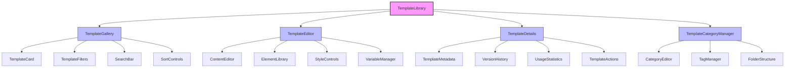
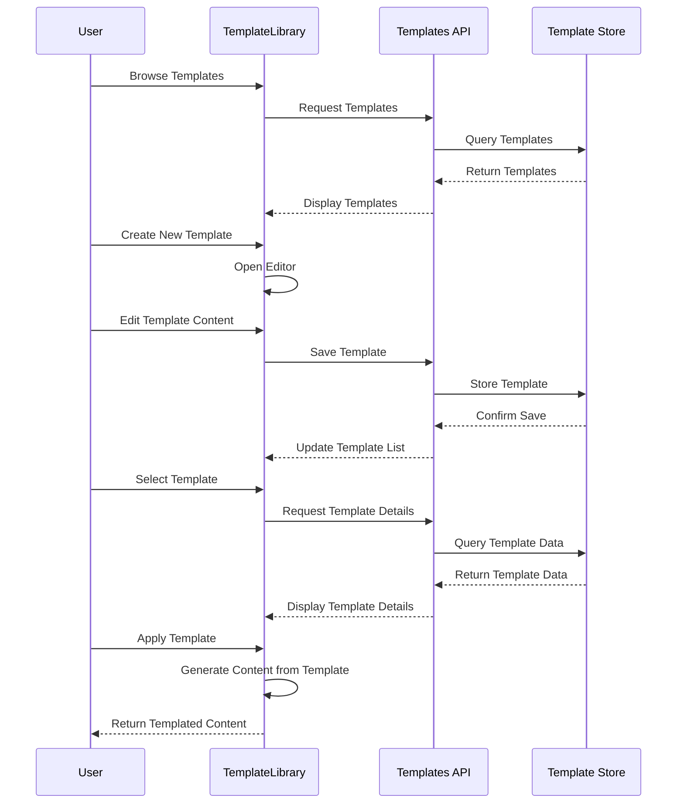
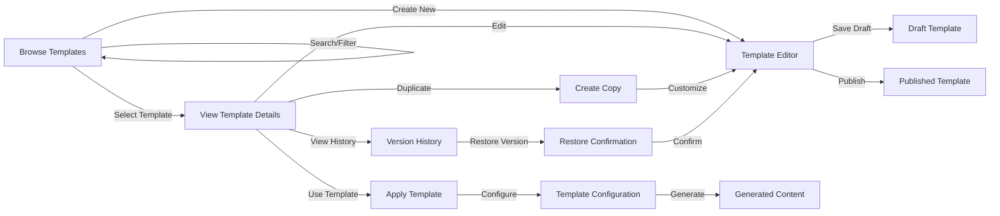

# TemplateLibrary Component

## Overview
The TemplateLibrary component provides a centralized system for managing, organizing, and using content templates across the application. It enables users to create, customize, and apply templates for emails, pages, documents, and other content types while maintaining brand consistency and optimizing workflow efficiency.

## Screenshots

### Template Gallery

*The main template gallery showing various template categories and previews*

### Template Editor

*The template editing interface with design tools and element options*

### Template Details

*Detailed view of a template with metadata, usage statistics, and actions*

### Template Categories

*Template organization by categories, tags, and usage type*

## Component Architecture



*Component hierarchy and relationships*

## Data Flow



*Data flow for template management operations*

## Features
- Comprehensive template library management
- Template creation and editing tools
- Category and tag organization
- Version control and history
- Template sharing and permissions
- Dynamic content variables
- Responsive design previews
- Template analytics and usage statistics
- Import/export capabilities
- Brand consistency enforcement
- Template duplication and customization
- Built-in design components
- Conditional content blocks

## Props

| Prop | Type | Required | Description |
|------|------|----------|-------------|
| initialView | 'gallery' \| 'editor' \| 'details' | No | Initial view to display |
| selectedTemplateId | string | No | ID of initially selected template |
| templateType | 'email' \| 'page' \| 'document' \| 'all' | No | Type of templates to display |
| filters | TemplateFilters | No | Initial filter configuration |
| onTemplateSelect | (templateId: string) => void | No | Callback when template is selected |
| onTemplateCreate | (template: Template) => void | No | Callback when template is created |
| onTemplateApply | (templateId: string, data?: any) => void | No | Callback when template is applied |
| onTemplateUpdate | (template: Template) => void | No | Callback when template is updated |
| onTemplateDelete | (templateId: string) => void | No | Callback when template is deleted |
| readOnly | boolean | No | Whether the library is in read-only mode |
| brandSettings | BrandSettings | No | Brand guidelines for template creation |

## Usage

```tsx
import { TemplateLibrary } from '@/components/templates/TemplateLibrary';

// Basic usage
<TemplateLibrary />

// With initial selected template
<TemplateLibrary
  initialView="details"
  selectedTemplateId="template-123"
/>

// With filtered template types
<TemplateLibrary
  templateType="email"
  filters={{
    categories: ['newsletter', 'transactional'],
    tags: ['approved']
  }}
/>

// With template application handler
<TemplateLibrary
  onTemplateApply={(templateId, data) => {
    console.log(`Applying template ${templateId} with data:`, data);
    // Use the template to generate content in another component
    generateContentFromTemplate(templateId, data);
  }}
/>

// With brand settings
<TemplateLibrary
  brandSettings={{
    colors: {
      primary: '#0066cc',
      secondary: '#f5a623',
      // Additional brand colors
    },
    fonts: {
      heading: 'Montserrat, sans-serif',
      body: 'Open Sans, sans-serif'
    },
    logo: '/images/logo.svg'
  }}
/>
```

## User Interaction Workflow



*User interaction flows within the template library component*

## Components

### TemplateGallery
Displays a grid or list of available templates with filtering and sorting options.

#### Props
- templates: Template[]
- onSelect: (templateId: string) => void
- filters: TemplateFilters
- onFilterChange: (filters: TemplateFilters) => void
- view: 'grid' | 'list'
- onViewChange: (view: 'grid' | 'list') => void

### TemplateEditor
Provides tools for creating and editing templates with a visual interface.

#### Features
- WYSIWYG editing capabilities
- Element library for dragging and dropping components
- Style controls for typography, colors, and layout
- Variable insertion for dynamic content
- Template preview in different formats/devices
- Revision history

### TemplateDetails
Displays comprehensive information about a selected template.

#### Features
- Metadata display (creation date, author, last modified)
- Usage statistics
- Version history
- Related templates
- Preview options
- Action buttons (edit, duplicate, delete, apply)

### TemplateCategoryManager
Manages the organization and categorization of templates.

#### Features
- Category creation and editing
- Tag management
- Folder structure for organization
- Bulk categorization tools
- Permission settings by category

## Data Models

### Template
```typescript
interface Template {
  id: string;
  name: string;
  description?: string;
  type: 'email' | 'page' | 'document' | 'social' | 'custom';
  thumbnail: string;
  content: {
    html: string;
    plainText?: string;
    design?: DesignStructure;
  };
  variables: TemplateVariable[];
  category?: string;
  tags: string[];
  author: {
    id: string;
    name: string;
  };
  permissions: {
    canView: string[]; // User/group IDs
    canEdit: string[]; // User/group IDs
  };
  usage: {
    count: number;
    lastUsed?: Date;
  };
  versions: {
    number: number;
    date: Date;
    author: string;
    comment?: string;
  }[];
  status: 'draft' | 'published' | 'archived';
  createdAt: Date;
  updatedAt: Date;
  isDefault?: boolean;
  isCustom?: boolean;
  metadata?: Record<string, any>;
}
```

### TemplateVariable
```typescript
interface TemplateVariable {
  id: string;
  name: string;
  type: 'text' | 'image' | 'link' | 'date' | 'number' | 'boolean' | 'conditional';
  defaultValue?: any;
  required: boolean;
  description?: string;
  validation?: {
    pattern?: string;
    min?: number;
    max?: number;
    options?: string[];
  };
  conditionalRules?: {
    condition: string;
    value: any;
    action: 'show' | 'hide';
    targetElements: string[];
  }[];
}
```

### DesignStructure
```typescript
interface DesignStructure {
  layout: {
    type: 'responsive' | 'fixed';
    width?: number;
    columns?: number;
    maxWidth?: number;
  };
  elements: DesignElement[];
  styles: {
    typography: {
      headingFont: string;
      bodyFont: string;
      baseSize: number;
    };
    colors: {
      primary: string;
      secondary: string;
      background: string;
      text: string;
      accent: string;
    };
    spacing: {
      unit: number;
      containerPadding: number;
    };
  };
}
```

## Styling
The component uses a combination of Tailwind CSS and custom styling:
- Responsive grid layouts for template gallery
- Interactive editor with real-time preview
- Drag-and-drop interfaces with visual feedback
- Brand-consistent visual design
- Accessible color themes
- Category color coding
- Printable template details view

## Accessibility
- ARIA attributes for interactive elements
- Keyboard navigation for template browsing and editing
- Focus management for gallery and detail views
- Screen reader support for template information
- Proper heading structure and semantic HTML
- Sufficient color contrast for template categorization
- Keyboard shortcuts for common actions
- Accessibility checker for created templates

## Error Handling
- Form validation for template metadata
- Error recovery for failed template saves
- Version conflict resolution
- Template validation before publishing
- Graceful degradation for unsupported browsers
- Responsive design validation
- Template dependency checking
- Permission verification for actions

## Performance Optimizations
- Virtualized gallery for large template collections
- Lazy loading of template thumbnails
- Optimized template rendering
- Efficient search and filtering algorithms
- Caching of frequently used templates
- Throttled auto-save in editor
- Optimized asset management
- Incremental loading of template details

## Dependencies
- react-beautiful-dnd
- @tinymce/tinymce-react
- react-virtualized
- @tanstack/react-query
- @tanstack/react-table
- handlebars (for template variables)
- lodash-es
- react-color (for color pickers)

## Related Components
- EmailEditor
- ContentBuilder
- MediaLibrary
- BrandStyleGuide
- VariableManager
- FormBuilder
- DocumentGenerator

## Examples

### Basic Implementation
```tsx
import { TemplateLibrary } from '@/components/templates/TemplateLibrary';

export default function TemplatesPage() {
  return (
    <div className="p-6">
      <h1 className="text-2xl font-bold mb-6">Template Library</h1>
      <TemplateLibrary />
    </div>
  );
}
```

### Email Template Management
```tsx
import { TemplateLibrary } from '@/components/templates/TemplateLibrary';
import { useEmailCampaign } from '@/hooks/useEmailCampaign';
import { useState } from 'react';

export default function EmailTemplatesPage() {
  const { createCampaignFromTemplate } = useEmailCampaign();
  const [selectedTemplate, setSelectedTemplate] = useState(null);
  
  const handleTemplateApply = (templateId, data) => {
    createCampaignFromTemplate(templateId, data)
      .then((campaign) => {
        console.log('Campaign created:', campaign);
        // Navigate to campaign editor
        router.push(`/campaigns/edit/${campaign.id}`);
      })
      .catch((error) => {
        console.error('Error creating campaign:', error);
      });
  };
  
  return (
    <div className="p-6">
      <h1 className="text-2xl font-bold mb-6">Email Templates</h1>
      <TemplateLibrary
        templateType="email"
        filters={{
          categories: ['marketing']
        }}
        onTemplateSelect={setSelectedTemplate}
        onTemplateApply={handleTemplateApply}
      />
      
      {selectedTemplate && (
        <div className="mt-4 p-4 border rounded-md bg-gray-50">
          <h2 className="text-lg font-medium">Selected Template: {selectedTemplate.name}</h2>
          <p>Use this template for your next email campaign.</p>
          <button 
            className="mt-2 px-4 py-2 bg-primary text-white rounded-md"
            onClick={() => handleTemplateApply(selectedTemplate.id)}
          >
            Create Campaign
          </button>
        </div>
      )}
    </div>
  );
}
```

### Template Creation with Brand Guidelines
```tsx
import { TemplateLibrary } from '@/components/templates/TemplateLibrary';
import { useBrandSettings } from '@/hooks/useBrandSettings';
import { useToast } from '@/components/ui/toast';

export default function BrandedTemplatesPage() {
  const { brandSettings } = useBrandSettings();
  const { toast } = useToast();
  
  const handleTemplateCreate = (template) => {
    // Save the template to the database
    saveTemplate(template)
      .then(() => {
        toast({
          title: "Success",
          description: "Template created successfully",
          variant: "success"
        });
      })
      .catch((error) => {
        toast({
          title: "Error",
          description: "Failed to create template",
          variant: "destructive"
        });
      });
  };
  
  return (
    <div className="p-6">
      <h1 className="text-2xl font-bold mb-6">Create Brand-Compliant Templates</h1>
      <p className="mb-4">
        All templates created here will automatically conform to our brand guidelines,
        including colors, typography, and spacing.
      </p>
      
      <TemplateLibrary
        initialView="editor"
        brandSettings={brandSettings}
        onTemplateCreate={handleTemplateCreate}
      />
    </div>
  );
}
```

## Best Practices
1. Create templates with responsiveness in mind
2. Use consistent naming conventions for templates
3. Implement proper categorization and tagging
4. Document template variables clearly
5. Maintain version history for important templates
6. Validate templates across different platforms
7. Follow accessibility guidelines in template design
8. Use template analytics to optimize usage

## Troubleshooting

### Common Issues
1. Template rendering inconsistencies across platforms
2. Variable placeholders not displaying correctly
3. Template permissions conflicts
4. Image sizing and responsiveness issues
5. Version conflicts during collaborative editing
6. Template gallery performance with many templates
7. Complex conditional logic failures

### Solutions
1. Test templates in multiple environments
2. Verify variable syntax and fallback values
3. Review permission hierarchy and ownership
4. Implement image dimension guidelines
5. Use proper versioning and locking mechanisms
6. Implement pagination and filtering for large collections
7. Simplify and test conditional rules thoroughly

## Contributing
When contributing to this component:
1. Follow established template structure patterns
2. Document all template variables and their usage
3. Include responsive design considerations
4. Add comprehensive unit tests
5. Maintain compatibility with existing templates
6. Follow brand guidelines for visual elements
7. Consider template export/import compatibility 