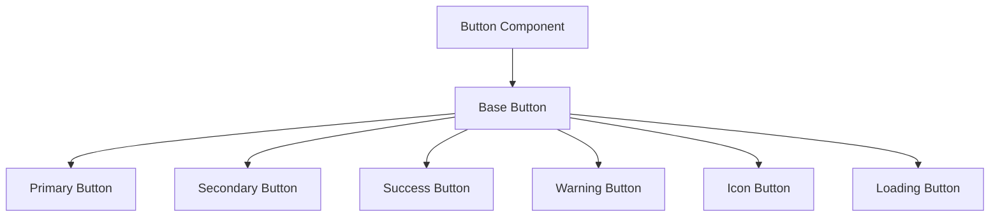
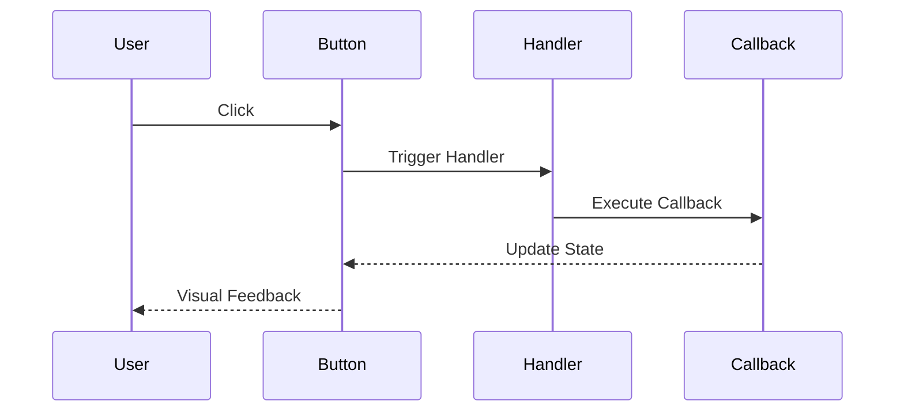
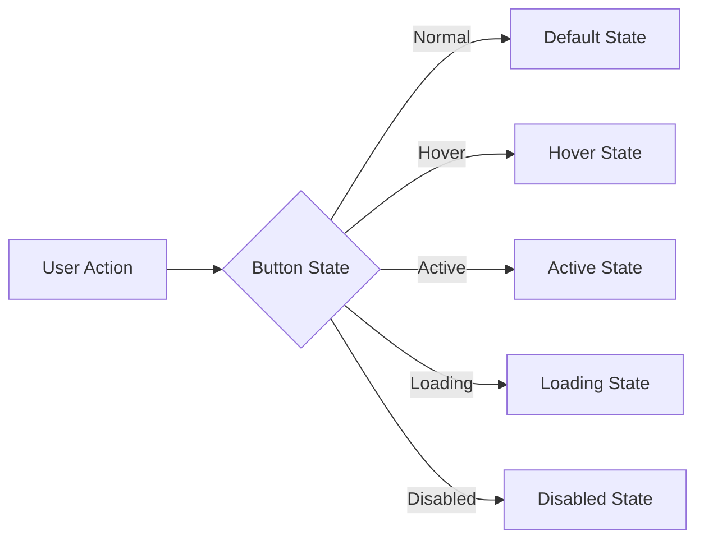

# Button Component

## Overview
The Button component is a fundamental UI element that provides interactive functionality throughout the ThriveSend application. It supports various styles, sizes, and states to accommodate different use cases while maintaining accessibility and performance standards.

## Screenshots

*Different button variants and states*

## Component Architecture


## Data Flow


## Features
- Multiple variants (primary, secondary, success, warning)
- Different sizes (sm, md, lg)
- Loading state support
- Icon integration
- Disabled state
- Full accessibility support
- TypeScript type safety
- Performance optimized

## Props
| Prop | Type | Default | Description |
|------|------|---------|-------------|
| variant | 'primary' \| 'secondary' \| 'success' \| 'warning' | 'primary' | Button style variant |
| size | 'sm' \| 'md' \| 'lg' | 'md' | Button size |
| disabled | boolean | false | Disables the button |
| loading | boolean | false | Shows loading state |
| icon | ReactNode | undefined | Icon to display |
| iconPosition | 'left' \| 'right' | 'left' | Icon position |
| onClick | (event: MouseEvent) => void | undefined | Click handler |
| className | string | undefined | Additional CSS classes |
| type | 'button' \| 'submit' \| 'reset' | 'button' | Button type |

## Usage
```typescript
import { Button } from '@/components/ui/Button';

// Basic usage
<Button variant="primary" className="text-custom-white">
  Click Me
</Button>

// With icon
<Button 
  variant="secondary" 
  icon={<IconComponent />}
  iconPosition="right"
>
  With Icon
</Button>

// Loading state
<Button 
  variant="success" 
  loading={true}
  className="text-custom-white"
>
  Loading...
</Button>

// Disabled state
<Button 
  variant="warning" 
  disabled={true}
  className="text-custom-white"
>
  Disabled
</Button>
```

## User Interaction Workflow


## Components
1. **Base Button**
   - Handles core button functionality
   - Manages state transitions
   - Implements accessibility features

2. **Icon Button**
   - Extends base button
   - Manages icon positioning
   - Handles icon animations

3. **Loading Button**
   - Extends base button
   - Manages loading state
   - Handles loading animation

## Data Models
```typescript
interface ButtonProps {
  variant: 'primary' | 'secondary' | 'success' | 'warning';
  size?: 'sm' | 'md' | 'lg';
  disabled?: boolean;
  loading?: boolean;
  icon?: ReactNode;
  iconPosition?: 'left' | 'right';
  onClick?: (event: MouseEvent) => void;
  className?: string;
  type?: 'button' | 'submit' | 'reset';
}

interface ButtonState {
  isHovered: boolean;
  isActive: boolean;
  isFocused: boolean;
}
```

## Styling
- Uses Tailwind CSS for styling
- Follows design system color tokens
- Implements consistent spacing
- Supports dark mode
- Maintains accessibility contrast ratios

## Accessibility
- ARIA labels for screen readers
- Keyboard navigation support
- Focus management
- Color contrast compliance
- Loading state announcements

## Error Handling
- Graceful fallback for missing props
- Type checking for variant and size
- Validation for icon components
- Error boundaries for click handlers

## Performance Optimizations
- Memoized click handlers
- Lazy loading for icons
- Optimized re-renders
- CSS-in-JS optimization

## Dependencies
- React
- TypeScript
- Tailwind CSS
- React Icons (optional)

## Related Components
- [Card](./Card.md)
- [Icon](./Icon.md)
- [Loading](./Loading.md)

## Examples
### Basic Button
```typescript
<Button variant="primary" className="text-custom-white">
  Primary Button
</Button>
```

### Icon Button
```typescript
<Button 
  variant="secondary"
  icon={<IconComponent />}
  iconPosition="right"
>
  Icon Button
</Button>
```

### Loading Button
```typescript
<Button 
  variant="success"
  loading={true}
  className="text-custom-white"
>
  Loading...
</Button>
```

## Best Practices
1. Always use semantic color classes
2. Include proper ARIA labels
3. Handle loading states appropriately
4. Use appropriate button types
5. Implement proper error handling
6. Follow accessibility guidelines
7. Optimize for performance
8. Use TypeScript for type safety

## Troubleshooting
### Common Issues
1. **Button not responding to clicks**
   - Check if disabled prop is set
   - Verify onClick handler
   - Check for event propagation issues

2. **Icon not displaying**
   - Verify icon component import
   - Check iconPosition prop
   - Validate icon component type

3. **Loading state not working**
   - Verify loading prop value
   - Check for conflicting states
   - Validate loading animation

### Solutions
1. **Click Issues**
   ```typescript
   // Ensure proper handler
   <Button onClick={(e) => {
     e.preventDefault();
     handleClick();
   }}>
     Click Me
   </Button>
   ```

2. **Icon Issues**
   ```typescript
   // Proper icon implementation
   <Button
     icon={<IconComponent className="w-4 h-4" />}
     iconPosition="right"
   >
     With Icon
   </Button>
   ```

3. **Loading Issues**
   ```typescript
   // Proper loading implementation
   <Button
     loading={isLoading}
     disabled={isLoading}
   >
     {isLoading ? 'Loading...' : 'Click Me'}
   </Button>
   ```

## Contributing
When contributing to the Button component:
1. Follow TypeScript best practices
2. Maintain accessibility standards
3. Add appropriate tests
4. Update documentation
5. Follow component guidelines

*Last Updated: 2025-06-04*
*Version: 1.0.0* 