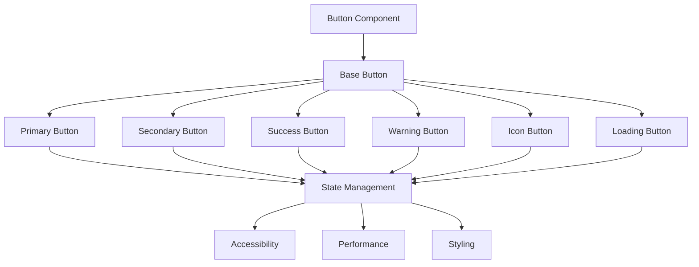
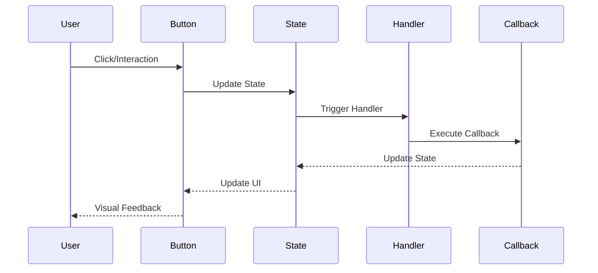
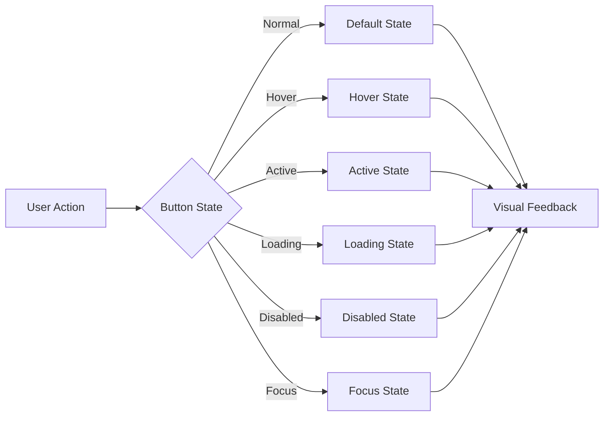

# Button Component

## Overview
The Button component is a fundamental UI element that provides interactive functionality throughout the ThriveSend application. It supports various styles, sizes, and states to accommodate different use cases while maintaining accessibility and performance standards.

## Screenshots

*Main view showing different button variants*


*Different states: default, hover, active, loading, and disabled*


*Available sizes: small, medium, and large*


*Buttons with icons in different positions*

## Component Architecture


## Data Flow


## Features
- Multiple variants (primary, secondary, success, warning)
- Different sizes (sm, md, lg)
- Loading state support
- Icon integration
- Disabled state
- Full accessibility support
- TypeScript type safety
- Performance optimized
- Dark mode support
- Custom theme support
- RTL support
- Focus management
- Keyboard navigation

## Props
| Name | Type | Required | Default | Description |
|------|------|----------|---------|-------------|
| variant | 'primary' \| 'secondary' \| 'success' \| 'warning' | Yes | 'primary' | Button style variant |
| size | 'sm' \| 'md' \| 'lg' | No | 'md' | Button size |
| disabled | boolean | No | false | Disables the button |
| loading | boolean | No | false | Shows loading state |
| icon | ReactNode | No | undefined | Icon to display |
| iconPosition | 'left' \| 'right' | No | 'left' | Icon position |
| onClick | (event: MouseEvent) => void | No | undefined | Click handler |
| className | string | No | undefined | Additional CSS classes |
| type | 'button' \| 'submit' \| 'reset' | No | 'button' | Button type |
| ariaLabel | string | No | undefined | ARIA label for accessibility |
| testId | string | No | undefined | Test ID for testing |

## Usage
```tsx
import { Button } from '@/components/ui/Button';

// Basic usage
<Button 
  variant="primary" 
  className="text-custom-white"
  ariaLabel="Submit form"
>
  Click Me
</Button>

// With icon
<Button 
  variant="secondary" 
  icon={<IconComponent />}
  iconPosition="right"
  ariaLabel="Download file"
>
  Download
</Button>

// Loading state
<Button 
  variant="success" 
  loading={true}
  className="text-custom-white"
  ariaLabel="Processing..."
>
  Processing
</Button>

// Disabled state
<Button 
  variant="warning" 
  disabled={true}
  className="text-custom-white"
  ariaLabel="Action not available"
>
  Unavailable
</Button>
```

## User Interaction Workflow


## Components

### Base Button
- Handles core button functionality
- Manages state transitions
- Implements accessibility features
- Handles event propagation
- Manages focus states

### Icon Button
- Extends base button
- Manages icon positioning
- Handles icon animations
- Supports RTL layouts
- Manages icon spacing

### Loading Button
- Extends base button
- Manages loading state
- Handles loading animation
- Prevents multiple clicks
- Shows loading indicator

## Data Models
```typescript
interface ButtonProps {
  variant: 'primary' | 'secondary' | 'success' | 'warning';
  size?: 'sm' | 'md' | 'lg';
  disabled?: boolean;
  loading?: boolean;
  icon?: ReactNode;
  iconPosition?: 'left' | 'right';
  onClick?: (event: MouseEvent) => void;
  className?: string;
  type?: 'button' | 'submit' | 'reset';
  ariaLabel?: string;
  testId?: string;
}

interface ButtonState {
  isHovered: boolean;
  isActive: boolean;
  isFocused: boolean;
  isLoading: boolean;
  isDisabled: boolean;
}

interface ButtonEvent {
  type: 'click' | 'hover' | 'focus' | 'blur';
  timestamp: number;
  target: HTMLElement;
}
```

## Styling
- Uses Tailwind CSS for styling
- Follows design system color tokens
- Implements consistent spacing
- Supports dark mode
- Maintains accessibility contrast ratios
- Uses CSS variables for theming
- Implements responsive design
- Supports custom animations
- Uses CSS Grid for layout
- Implements proper transitions

## Accessibility
- ARIA labels for screen readers
- Keyboard navigation support
- Focus management
- Color contrast compliance
- Loading state announcements
- RTL support
- Screen reader announcements
- Focus visible states
- Proper role attributes
- Keyboard event handling

## Error Handling
- Graceful fallback for missing props
- Type checking for variant and size
- Validation for icon components
- Error boundaries for click handlers
- Loading state management
- Disabled state handling
- Event propagation control
- Error logging
- Recovery strategies
- User feedback

## Performance Optimizations
- Memoized click handlers
- Lazy loading for icons
- Optimized re-renders
- CSS-in-JS optimization
- Event debouncing
- State batching
- Code splitting
- Bundle optimization
- Memory management
- Render optimization

## Dependencies
- React
- TypeScript
- Tailwind CSS
- React Icons (optional)
- @testing-library/react
- @testing-library/jest-dom
- @testing-library/user-event

## Related Components
- [Card](./Card.md)
- [Icon](./Icon.md)
- [Loading](./Loading.md)
- [Tooltip](./Tooltip.md)
- [Badge](./Badge.md)

## Examples

### Basic Example
```tsx
import { Button } from '@/components/ui/Button';

export function BasicExample() {
  return (
    <Button 
      variant="primary" 
      className="text-custom-white"
      ariaLabel="Submit form"
    >
      Submit
    </Button>
  );
}
```

### Advanced Example
```tsx
import { Button } from '@/components/ui/Button';
import { useCallback, useState } from 'react';

export function AdvancedExample() {
  const [isLoading, setIsLoading] = useState(false);
  
  const handleClick = useCallback(async () => {
    setIsLoading(true);
    try {
      await submitData();
    } catch (error) {
      console.error(error);
    } finally {
      setIsLoading(false);
    }
  }, []);

  return (
    <Button 
      variant="success"
      loading={isLoading}
      className="text-custom-white"
      onClick={handleClick}
      ariaLabel={isLoading ? 'Processing...' : 'Submit data'}
    >
      {isLoading ? 'Processing...' : 'Submit'}
    </Button>
  );
}
```

## Best Practices

### Usage Guidelines
1. Always use semantic color classes
2. Include proper ARIA labels
3. Handle loading states appropriately
4. Use appropriate button types
5. Implement proper error handling
6. Follow accessibility guidelines
7. Optimize for performance
8. Use TypeScript for type safety
9. Add proper test IDs
10. Handle edge cases

### Performance Tips
1. Memoize event handlers
2. Use proper state management
3. Optimize re-renders
4. Implement proper loading states
5. Use proper error boundaries
6. Optimize bundle size
7. Use proper code splitting
8. Implement proper caching
9. Use proper lazy loading
10. Monitor performance metrics

### Security Considerations
1. Validate user input
2. Prevent XSS attacks
3. Handle sensitive data
4. Implement proper authentication
5. Use proper authorization
6. Handle errors securely
7. Implement proper logging
8. Use proper encryption
9. Follow security best practices
10. Regular security audits

## Troubleshooting

### Common Issues
| Issue | Solution |
|-------|----------|
| Button not responding to clicks | Check disabled prop and onClick handler |
| Icon not displaying | Verify icon component and position |
| Loading state not working | Check loading prop and animation |
| Styling issues | Verify Tailwind classes and theme |
| Accessibility issues | Check ARIA labels and keyboard navigation |

### Error Messages
| Error Code | Description | Resolution |
|------------|-------------|------------|
| ERR001 | Invalid variant | Use valid variant value |
| ERR002 | Invalid size | Use valid size value |
| ERR003 | Invalid icon | Use valid icon component |
| ERR004 | Invalid event | Check event handler |
| ERR005 | Invalid state | Check state management |

## Contributing

### Development Setup
1. Clone the repository
2. Install dependencies
3. Run development server
4. Make changes
5. Run tests
6. Submit PR

### Testing
```typescript
import { render, screen, fireEvent } from '@testing-library/react';
import { Button } from './Button';

describe('Button', () => {
  it('renders correctly', () => {
    render(<Button variant="primary">Click Me</Button>);
    expect(screen.getByText('Click Me')).toBeInTheDocument();
  });

  it('handles click events', () => {
    const handleClick = jest.fn();
    render(<Button variant="primary" onClick={handleClick}>Click Me</Button>);
    fireEvent.click(screen.getByText('Click Me'));
    expect(handleClick).toHaveBeenCalled();
  });
});
```

### Code Style
- Follow TypeScript best practices
- Use ESLint rules
- Follow Prettier configuration
- Write meaningful comments
- Use proper naming conventions
- Follow component patterns
- Use proper documentation
- Follow testing practices
- Use proper error handling
- Follow security guidelines

## Changelog

### Version 1.0.0
- Initial release
- Basic button functionality
- Multiple variants
- Size options
- Icon support

### Version 1.1.0
- Added loading state
- Improved accessibility
- Enhanced performance
- Added dark mode
- Added RTL support

## Appendix

### Glossary
- **Variant**: Button style type
- **State**: Button interaction state
- **Icon**: Visual element in button
- **Loading**: Processing state
- **Disabled**: Inactive state

### FAQ
#### How do I add an icon to a button?
Use the icon prop and iconPosition prop to add and position icons.

#### How do I handle loading states?
Use the loading prop to show loading state and prevent multiple clicks.

#### How do I make the button accessible?
Include proper ARIA labels and ensure keyboard navigation works. 