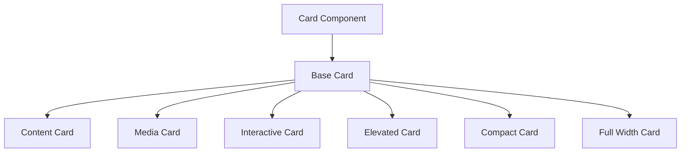
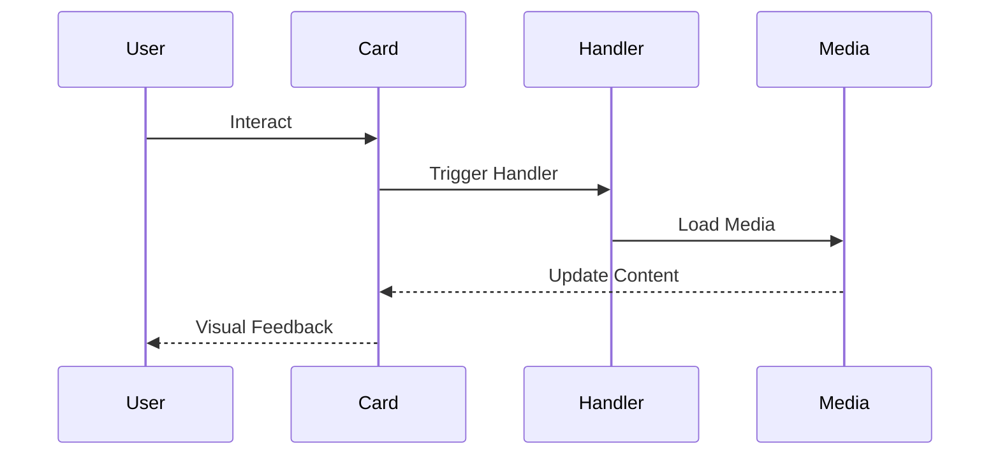
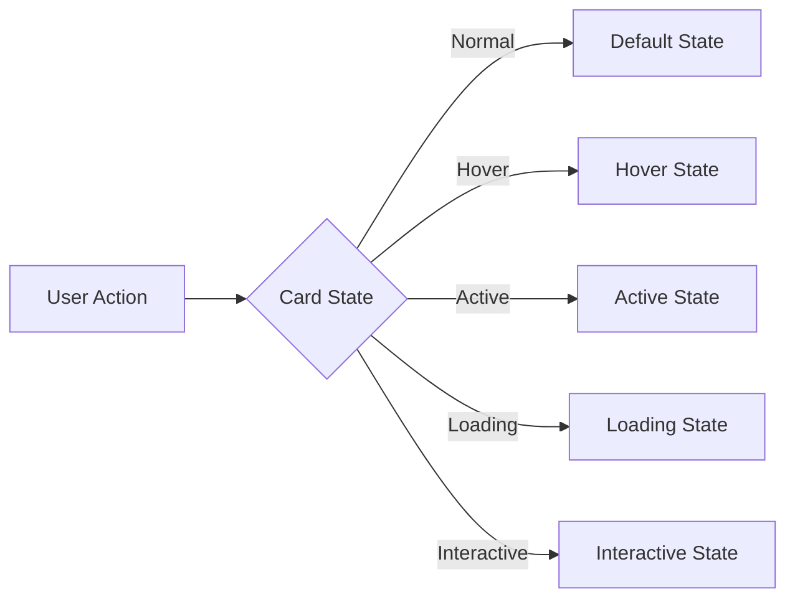

# Card Component

## Overview
The Card component is a versatile container that provides a structured way to display content in the ThriveSend application. It supports various layouts, media content, and interactive elements while maintaining consistent styling and accessibility standards.

## Screenshots

*Different card variants and layouts*

## Component Architecture


## Data Flow


## Features
- Multiple variants (default, elevated, interactive)
- Header and footer sections
- Media content support
- Interactive elements
- Responsive layouts
- Full accessibility support
- TypeScript type safety
- Performance optimized

## Props
| Prop | Type | Default | Description |
|------|------|---------|-------------|
| variant | 'default' \| 'elevated' \| 'interactive' | 'default' | Card style variant |
| padding | 'none' \| 'sm' \| 'md' \| 'lg' | 'md' | Content padding |
| header | ReactNode | undefined | Header content |
| footer | ReactNode | undefined | Footer content |
| media | ReactNode | undefined | Media content |
| onClick | (event: MouseEvent) => void | undefined | Click handler |
| className | string | undefined | Additional CSS classes |
| isInteractive | boolean | false | Enables hover effects |
| isLoading | boolean | false | Shows loading state |

## Usage
```typescript
import { Card } from '@/components/ui/Card';

// Basic card
<Card>
  <Card.Header>Card Title</Card.Header>
  <Card.Content>
    Card content goes here
  </Card.Content>
  <Card.Footer>Card footer</Card.Footer>
</Card>

// Media card
<Card variant="elevated">
  <Card.Media>
    
  </Card.Media>
  <Card.Content>
    Media card content
  </Card.Content>
</Card>

// Interactive card
<Card 
  variant="interactive"
  onClick={handleClick}
  isInteractive={true}
>
  <Card.Content>
    Clickable card content
  </Card.Content>
</Card>

// Loading state
<Card isLoading={true}>
  <Card.Content>
    Loading content...
  </Card.Content>
</Card>
```

## User Interaction Workflow


## Components
1. **Base Card**
   - Handles core card functionality
   - Manages layout structure
   - Implements accessibility features

2. **Card Header**
   - Manages header content
   - Handles header styling
   - Supports custom elements

3. **Card Content**
   - Manages main content
   - Handles content layout
   - Supports rich content

4. **Card Footer**
   - Manages footer content
   - Handles footer styling
   - Supports action buttons

5. **Card Media**
   - Manages media content
   - Handles media loading
   - Supports various media types

## Data Models
```typescript
interface CardProps {
  variant?: 'default' | 'elevated' | 'interactive';
  padding?: 'none' | 'sm' | 'md' | 'lg';
  header?: ReactNode;
  footer?: ReactNode;
  media?: ReactNode;
  onClick?: (event: MouseEvent) => void;
  className?: string;
  isInteractive?: boolean;
  isLoading?: boolean;
}

interface CardState {
  isHovered: boolean;
  isActive: boolean;
  isFocused: boolean;
  isLoading: boolean;
}

interface CardContext {
  variant: CardProps['variant'];
  padding: CardProps['padding'];
  isInteractive: boolean;
}
```

## Styling
- Uses Tailwind CSS for styling
- Follows design system color tokens
- Implements consistent spacing
- Supports dark mode
- Maintains accessibility contrast ratios
- Responsive design patterns

## Accessibility
- ARIA roles and labels
- Keyboard navigation support
- Focus management
- Color contrast compliance
- Loading state announcements
- Screen reader support

## Error Handling
- Graceful fallback for missing content
- Type checking for variant and padding
- Validation for media content
- Error boundaries for interactive elements
- Loading state management

## Performance Optimizations
- Lazy loading for media content
- Optimized re-renders
- CSS-in-JS optimization
- Image optimization
- Content virtualization for lists

## Dependencies
- React
- TypeScript
- Tailwind CSS
- React Icons (optional)
- Image optimization library

## Related Components
- [Button](./Button.md)
- [Image](./Image.md)
- [Loading](./Loading.md)

## Examples
### Basic Card
```typescript
<Card>
  <Card.Header>
    <h3 className="text-lg font-semibold">Card Title</h3>
  </Card.Header>
  <Card.Content>
    <p>Basic card content</p>
  </Card.Content>
  <Card.Footer>
    <Button variant="primary" className="text-custom-white">
      Action
    </Button>
  </Card.Footer>
</Card>
```

### Media Card
```typescript
<Card variant="elevated">
  <Card.Media>
    
  </Card.Media>
  <Card.Content>
    <h3 className="text-lg font-semibold">Media Card</h3>
    <p>Card with media content</p>
  </Card.Content>
</Card>
```

### Interactive Card
```typescript
<Card 
  variant="interactive"
  onClick={handleClick}
  isInteractive={true}
  className="hover:shadow-lg transition-shadow"
>
  <Card.Content>
    <h3 className="text-lg font-semibold">Interactive Card</h3>
    <p>Click to interact</p>
  </Card.Content>
</Card>
```

## Best Practices
1. Use appropriate card variants
2. Maintain consistent padding
3. Include proper ARIA labels
4. Handle loading states appropriately
5. Optimize media content
6. Follow accessibility guidelines
7. Implement responsive design
8. Use TypeScript for type safety

## Troubleshooting
### Common Issues
1. **Card not displaying properly**
   - Check padding and margin
   - Verify content structure
   - Check for conflicting styles

2. **Media not loading**
   - Verify media source
   - Check image optimization
   - Validate media component

3. **Interactive features not working**
   - Check isInteractive prop
   - Verify onClick handler
   - Check event propagation

### Solutions
1. **Display Issues**
   ```typescript
   // Proper card structure
   <Card padding="md" className="max-w-md">
     <Card.Header>Header</Card.Header>
     <Card.Content>Content</Card.Content>
     <Card.Footer>Footer</Card.Footer>
   </Card>
   ```

2. **Media Issues**
   ```typescript
   // Proper media implementation
   <Card>
     <Card.Media>
       
     </Card.Media>
     <Card.Content>Content</Card.Content>
   </Card>
   ```

3. **Interactive Issues**
   ```typescript
   // Proper interactive implementation
   <Card
     variant="interactive"
     isInteractive={true}
     onClick={(e) => {
       e.preventDefault();
       handleClick();
     }}
     className="cursor-pointer"
   >
     <Card.Content>Content</Card.Content>
   </Card>
   ```

## Contributing
When contributing to the Card component:
1. Follow TypeScript best practices
2. Maintain accessibility standards
3. Add appropriate tests
4. Update documentation
5. Follow component guidelines

*Last Updated: 2025-06-04*
*Version: 1.0.0* 