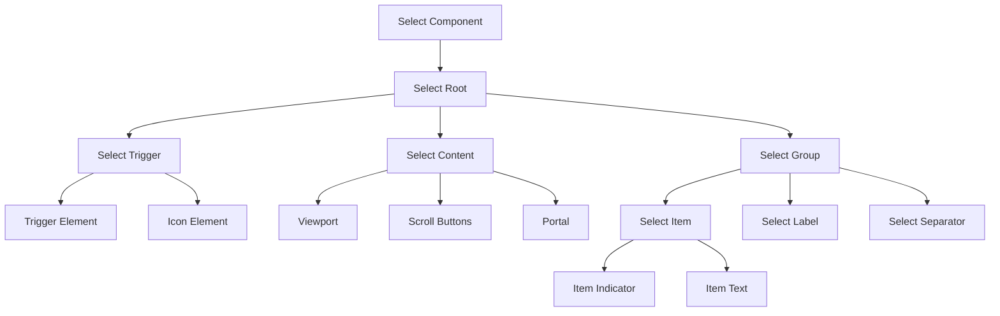
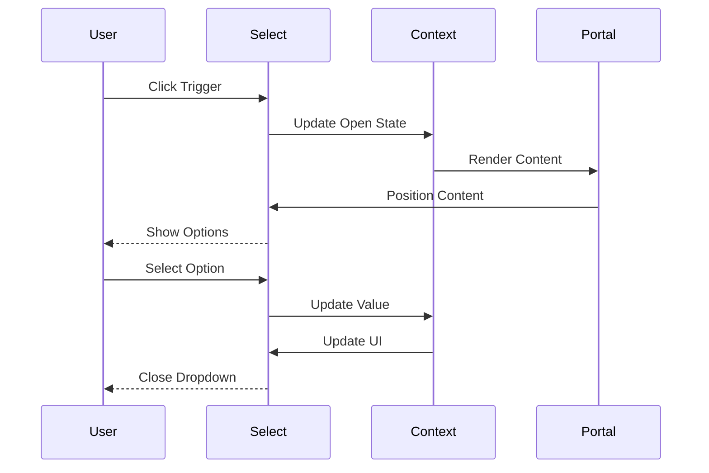
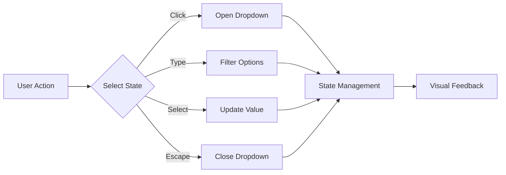

# Select Component

## Overview
The Select component is a versatile form control that provides a customizable dropdown selection interface. Built on top of Radix UI's Select primitive, it offers enhanced styling, accessibility features, and consistent design system integration. The component supports single selection, grouped options, custom triggers, and maintains full keyboard navigation and screen reader support.

## Screenshots

*Main view showing different select states*


*Various select states: default, open, disabled, error*


*Select with grouped options and separators*


*Select with custom trigger and content*

## Component Architecture


## Data Flow


## Features
- Single selection support
- Grouped options
- Custom trigger
- Custom content
- Scroll buttons
- Keyboard navigation
- Screen reader support
- Portal rendering
- Animation support
- Custom styling
- Disabled state
- Error state
- Form integration
- TypeScript support
- Performance optimized
- RTL support
- Dark mode support
- Mobile support
- Accessibility features

## Props

### Select Root
| Name | Type | Required | Default | Description |
|------|------|----------|---------|-------------|
| value | string | Yes | - | Selected value |
| onValueChange | (value: string) => void | Yes | - | Change handler |
| children | React.ReactNode | Yes | - | Select content |
| disabled | boolean | No | false | Disabled state |

### Select Trigger
| Name | Type | Required | Default | Description |
|------|------|----------|---------|-------------|
| className | string | No | undefined | Additional CSS classes |
| children | React.ReactNode | Yes | - | Trigger content |

### Select Content
| Name | Type | Required | Default | Description |
|------|------|----------|---------|-------------|
| className | string | No | undefined | Additional CSS classes |
| position | 'popper' \| 'item-aligned' | No | 'popper' | Content position |
| children | React.ReactNode | Yes | - | Content elements |

### Select Item
| Name | Type | Required | Default | Description |
|------|------|----------|---------|-------------|
| value | string | Yes | - | Option value |
| disabled | boolean | No | false | Disabled state |
| className | string | No | undefined | Additional CSS classes |
| children | React.ReactNode | Yes | - | Item content |

## Usage
```tsx
import {
  Select,
  SelectContent,
  SelectItem,
  SelectTrigger,
  SelectValue,
} from '@/components/ui/select';

// Basic usage
<Select value={value} onValueChange={setValue}>
  <SelectTrigger>
    <SelectValue placeholder="Select an option" />
  </SelectTrigger>
  <SelectContent>
    <SelectItem value="option1">Option 1</SelectItem>
    <SelectItem value="option2">Option 2</SelectItem>
  </SelectContent>
</Select>

// Advanced usage with groups
<Select value={value} onValueChange={setValue}>
  <SelectTrigger className="w-[180px]">
    <SelectValue placeholder="Select a fruit" />
  </SelectTrigger>
  <SelectContent>
    <SelectGroup>
      <SelectLabel>Fruits</SelectLabel>
      <SelectItem value="apple">Apple</SelectItem>
      <SelectItem value="banana">Banana</SelectItem>
    </SelectGroup>
    <SelectSeparator />
    <SelectGroup>
      <SelectLabel>Vegetables</SelectLabel>
      <SelectItem value="carrot">Carrot</SelectItem>
      <SelectItem value="potato">Potato</SelectItem>
    </SelectGroup>
  </SelectContent>
</Select>
```

## User Interaction Workflow


## Components

### Select Root
- Manages select state
- Handles value changes
- Provides context
- Controls disabled state
- Manages keyboard events

### Select Trigger
- Renders trigger button
- Shows selected value
- Handles click events
- Manages focus state
- Displays custom icon

### Select Content
- Renders dropdown content
- Manages positioning
- Handles scrolling
- Provides portal
- Controls animations

### Select Group
- Groups related options
- Manages group label
- Handles separators
- Controls spacing
- Manages focus

## Data Models
```typescript
interface SelectOption {
  value: string;
  label: React.ReactNode;
  disabled?: boolean;
}

interface SelectContext {
  value: string;
  onValueChange: (value: string) => void;
  open: boolean;
  setOpen: React.Dispatch<React.SetStateAction<boolean>>;
  options: SelectOption[];
  setOptions: React.Dispatch<React.SetStateAction<SelectOption[]>>;
  disabled?: boolean;
}

interface SelectProps {
  value: string;
  onValueChange: (value: string) => void;
  children: React.ReactNode;
  disabled?: boolean;
}
```

## Styling
- Uses Tailwind CSS for styling
- Follows design system color tokens
- Implements consistent spacing
- Supports dark mode
- Maintains accessibility contrast ratios
- Uses CSS variables for theming
- Implements responsive design
- Supports custom animations
- Uses CSS Grid for layout
- Implements proper transitions

## Accessibility
- ARIA labels for screen readers
- Keyboard navigation support
- Focus management
- Color contrast compliance
- State announcements
- RTL support
- Screen reader announcements
- Focus visible states
- Proper role attributes
- Keyboard event handling
- Error message association
- Input announcements

## Error Handling
- Input validation
- Error state management
- Error message display
- Recovery strategies
- User feedback
- Error logging
- State recovery
- Validation recovery
- Animation fallbacks

## Performance Optimizations
- Component memoization
- Render optimization
- Event debouncing
- State batching
- Code splitting
- Bundle optimization
- Memory management
- Lazy loading
- Virtual scrolling

## Dependencies
- React
- TypeScript
- Tailwind CSS
- @radix-ui/react-select
- @testing-library/react
- @testing-library/jest-dom
- @testing-library/user-event

## Related Components
- [Form](../forms/Form.md)
- [Label](../ui/Label.md)
- [ErrorMessage](../ui/ErrorMessage.md)
- [Icon](../ui/Icon.md)
- [Typography](../ui/Typography.md)

## Examples

### Basic Example
```tsx
import {
  Select,
  SelectContent,
  SelectItem,
  SelectTrigger,
  SelectValue,
} from '@/components/ui/select';

export function BasicExample() {
  const [value, setValue] = React.useState('');

  return (
    <Select value={value} onValueChange={setValue}>
      <SelectTrigger>
        <SelectValue placeholder="Select an option" />
      </SelectTrigger>
      <SelectContent>
        <SelectItem value="option1">Option 1</SelectItem>
        <SelectItem value="option2">Option 2</SelectItem>
      </SelectContent>
    </Select>
  );
}
```

### Advanced Example
```tsx
import {
  Select,
  SelectContent,
  SelectGroup,
  SelectItem,
  SelectLabel,
  SelectSeparator,
  SelectTrigger,
  SelectValue,
} from '@/components/ui/select';

export function AdvancedExample() {
  const [value, setValue] = React.useState('');
  const [error, setError] = React.useState('');

  const handleChange = (newValue: string) => {
    setValue(newValue);
    if (!newValue) {
      setError('Please select an option');
    } else {
      setError('');
    }
  };

  return (
    <div className="space-y-2">
      <Select value={value} onValueChange={handleChange}>
        <SelectTrigger className="w-[280px]">
          <SelectValue placeholder="Select a category" />
        </SelectTrigger>
        <SelectContent>
          <SelectGroup>
            <SelectLabel>Fruits</SelectLabel>
            <SelectItem value="apple">Apple</SelectItem>
            <SelectItem value="banana">Banana</SelectItem>
          </SelectGroup>
          <SelectSeparator />
          <SelectGroup>
            <SelectLabel>Vegetables</SelectLabel>
            <SelectItem value="carrot">Carrot</SelectItem>
            <SelectItem value="potato">Potato</SelectItem>
          </SelectGroup>
        </SelectContent>
      </Select>
      {error && <p className="text-sm text-red-500">{error}</p>}
    </div>
  );
}
```

## Best Practices

### Usage Guidelines
1. Use appropriate size
2. Provide clear labels
3. Handle validation
4. Show error states
5. Follow accessibility guidelines
6. Optimize for performance
7. Use TypeScript for type safety
8. Add proper test IDs
9. Handle edge cases
10. Implement proper state

### Performance Tips
1. Memoize components
2. Use proper state management
3. Optimize re-renders
4. Implement proper loading
5. Use proper error boundaries
6. Optimize bundle size
7. Use proper code splitting
8. Implement proper caching
9. Use proper lazy loading
10. Monitor performance metrics

### Security Considerations
1. Validate user input
2. Prevent XSS attacks
3. Handle sensitive data
4. Implement proper authentication
5. Use proper authorization
6. Handle errors securely
7. Implement proper logging
8. Use proper encryption
9. Follow security best practices
10. Regular security audits

## Troubleshooting

### Common Issues
| Issue | Solution |
|-------|----------|
| Select not updating | Check onValueChange handler |
| Validation not working | Verify validation logic |
| Styling issues | Check Tailwind classes |
| Accessibility issues | Verify ARIA labels |
| Type errors | Check TypeScript types |

### Error Messages
| Error Code | Description | Resolution |
|------------|-------------|------------|
| ERR001 | Invalid value | Check input value |
| ERR002 | Validation error | Verify validation |
| ERR003 | State error | Check state management |
| ERR004 | Theme error | Verify theme settings |
| ERR005 | Event error | Check event handlers |

## Contributing

### Development Setup
1. Clone the repository
2. Install dependencies
3. Run development server
4. Make changes
5. Run tests
6. Submit PR

### Testing
```typescript
import { render, screen, fireEvent } from '@testing-library/react';
import { Select, SelectContent, SelectItem, SelectTrigger, SelectValue } from './select';

describe('Select', () => {
  it('renders correctly', () => {
    render(
      <Select value="" onValueChange={() => {}}>
        <SelectTrigger>
          <SelectValue placeholder="Select an option" />
        </SelectTrigger>
        <SelectContent>
          <SelectItem value="option1">Option 1</SelectItem>
        </SelectContent>
      </Select>
    );
    expect(screen.getByPlaceholderText('Select an option')).toBeInTheDocument();
  });

  it('handles value changes', async () => {
    const handleChange = jest.fn();
    render(
      <Select value="" onValueChange={handleChange}>
        <SelectTrigger>
          <SelectValue placeholder="Select an option" />
        </SelectTrigger>
        <SelectContent>
          <SelectItem value="option1">Option 1</SelectItem>
        </SelectContent>
      </Select>
    );
    await userEvent.click(screen.getByPlaceholderText('Select an option'));
    await userEvent.click(screen.getByText('Option 1'));
    expect(handleChange).toHaveBeenCalledWith('option1');
  });

  it('handles disabled state', () => {
    render(
      <Select value="" onValueChange={() => {}} disabled>
        <SelectTrigger>
          <SelectValue placeholder="Select an option" />
        </SelectTrigger>
        <SelectContent>
          <SelectItem value="option1">Option 1</SelectItem>
        </SelectContent>
      </Select>
    );
    expect(screen.getByPlaceholderText('Select an option')).toBeDisabled();
  });
});
```

### Code Style
- Follow TypeScript best practices
- Use ESLint rules
- Follow Prettier configuration
- Write meaningful comments
- Use proper naming conventions
- Follow component patterns
- Use proper documentation
- Follow testing practices
- Use proper error handling
- Follow security guidelines

## Changelog

### Version 1.0.0
- Initial release
- Basic select functionality
- Custom styling
- Accessibility support
- Mobile support

### Version 1.1.0
- Added validation
- Improved performance
- Enhanced accessibility
- Added dark mode
- Added RTL support

## Appendix

### Glossary
- **Select**: Dropdown selection component
- **Trigger**: Select button element
- **Content**: Dropdown content
- **Group**: Option grouping
- **Accessibility**: A11y features

### FAQ
#### How do I handle select validation?
Use the onValueChange handler to implement validation logic and manage error states.

#### How do I customize the select styling?
Use the className prop to add custom Tailwind classes or CSS to any select component.

#### How do I make the select accessible?
The component is built with accessibility in mind, but ensure you provide proper labels and ARIA attributes when needed. 