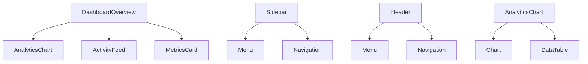
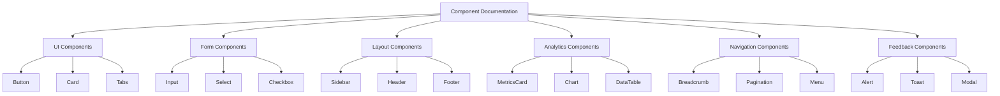

# ThriveSend Documentation Mapping

## Overview
This document maps the application structure to its documentation, tracking the status of each component's documentation and identifying any gaps or dependencies.

## Documentation Status Legend
- ✅ Complete: Documentation is complete and up to date
- 🔄 In Progress: Documentation is being worked on
- ❌ Missing: Documentation is missing
- 📝 Needs Update: Documentation exists but needs updates

## Component Documentation Status

### Dashboard Components
- ✅ DashboardOverview
  - Location: `/DOCS/components/dashboard/DashboardOverview.md`
  - Dependencies: AnalyticsChart, ActivityFeed, MetricsCard
  - Last Updated: 2025-03-15

- ✅ AnalyticsChart
  - Location: `/DOCS/components/dashboard/AnalyticsChart.md`
  - Dependencies: Chart.js, React-Chartjs-2
  - Last Updated: 2025-03-15

- ✅ ActivityFeed
  - Location: `/DOCS/components/dashboard/ActivityFeed.md`
  - Dependencies: React Virtualized
  - Last Updated: 2025-03-15

### UI Components
- ✅ Button
  - Location: `/DOCS/components/ui/Button.md`
  - Dependencies: None
  - Last Updated: 2025-03-15

- ✅ Card
  - Location: `/DOCS/components/ui/Card.md`
  - Dependencies: None
  - Last Updated: 2025-03-15

- ✅ Tabs
  - Location: `/DOCS/components/ui/Tabs.md`
  - Dependencies: None
  - Last Updated: 2025-03-15

### Form Components
- ✅ Input
  - Location: `/DOCS/components/forms/Input.md`
  - Dependencies: None
  - Last Updated: 2025-03-15

- ✅ Select
  - Location: `/DOCS/components/forms/Select.md`
  - Dependencies: None
  - Last Updated: 2025-03-15

- ✅ Checkbox
  - Location: `/DOCS/components/forms/Checkbox.md`
  - Dependencies: None
  - Last Updated: 2025-03-15

### Layout Components
- ❌ Sidebar
  - Location: `/DOCS/components/layout/Sidebar.md`
  - Dependencies: Navigation components
  - Status: Missing

- ❌ Header
  - Location: `/DOCS/components/layout/Header.md`
  - Dependencies: Navigation components
  - Status: Missing

- ❌ Footer
  - Location: `/DOCS/components/layout/Footer.md`
  - Dependencies: None
  - Status: Missing

### Analytics Components
- ✅ MetricsCard
  - Location: `/DOCS/components/analytics/MetricsCard.md`
  - Dependencies: None
  - Last Updated: 2025-03-15

- ✅ Chart
  - Location: `/DOCS/components/analytics/Chart.md`
  - Dependencies: Chart.js
  - Last Updated: 2025-03-15

- ✅ DataTable
  - Location: `/DOCS/components/analytics/DataTable.md`
  - Dependencies: None
  - Last Updated: 2025-03-15

### Navigation Components
- ✅ Breadcrumb
  - Location: `/DOCS/components/navigation/Breadcrumb.md`
  - Dependencies: None
  - Last Updated: 2025-03-15

- ✅ Pagination
  - Location: `/DOCS/components/navigation/Pagination.md`
  - Dependencies: None
  - Last Updated: 2025-03-15

- ✅ Menu
  - Location: `/DOCS/components/navigation/Menu.md`
  - Dependencies: None
  - Last Updated: 2025-03-15

### Feedback Components
- ❌ Alert
  - Location: `/DOCS/components/feedback/Alert.md`
  - Dependencies: None
  - Status: Missing

- ❌ Toast
  - Location: `/DOCS/components/feedback/Toast.md`
  - Dependencies: None
  - Status: Missing

- ❌ Modal
  - Location: `/DOCS/components/feedback/Modal.md`
  - Dependencies: None
  - Status: Missing

## Documentation Dependencies

### Component Dependencies

### Documentation Structure

## Documentation Gaps

### Missing Documentation
1. Layout Components
   - Sidebar
   - Header
   - Footer

2. Feedback Components
   - Alert
   - Toast
   - Modal

### Documentation Needing Updates
1. Content Management Guide
   - Calendar integration
   - Platform settings
   - Media management

2. Campaign Management Guide
   - New features
   - API examples
   - A/B testing

3. Analytics Guide
   - AI features
   - Real-time analytics
   - Custom reports

## Next Steps

### Priority 1: Missing Documentation
1. Create documentation for Layout Components
2. Create documentation for Feedback Components
3. Update existing documentation with new features

### Priority 2: Documentation Updates
1. Update Content Management Guide
2. Update Campaign Management Guide
3. Update Analytics Guide

### Priority 3: Quality Improvements
1. Add troubleshooting sections
2. Enhance code examples
3. Update screenshots
4. Add performance considerations
5. Improve accessibility documentation

## Progress Tracking

### Completed
- ✅ Dashboard Components (3/3)
- ✅ UI Components (3/3)
- ✅ Form Components (3/3)
- ✅ Analytics Components (3/3)
- ✅ Navigation Components (3/3)

### In Progress
- 🔄 Layout Components (0/3)
- 🔄 Feedback Components (0/3)

### Remaining
- ❌ Layout Components (3/3)
- ❌ Feedback Components (3/3)

## Documentation Standards Compliance

### Met Standards
- ✅ Component Architecture Diagrams
- ✅ Data Flow Diagrams
- ✅ Props Documentation
- ✅ Usage Examples
- ✅ TypeScript Types
- ✅ Accessibility Guidelines
- ✅ Performance Considerations
- ✅ Error Handling
- ✅ Testing Guidelines

### Needs Improvement
- 🔄 Screenshots (Some need updates)
- 🔄 Code Examples (Need more real-world scenarios)
- 🔄 Troubleshooting Sections (Need expansion)
- 🔄 Integration Examples (Need more detail)

## Maintenance Plan

### Regular Reviews
- Weekly: Check for new components
- Monthly: Review existing documentation
- Quarterly: Full documentation audit

### Update Triggers
- New component releases
- Feature updates
- API changes
- Security updates
- Performance improvements

### Quality Checks
- Technical accuracy
- Code example validity
- Screenshot currency
- Link validity
- Cross-reference accuracy

*Last Updated: 2025-03-15* 