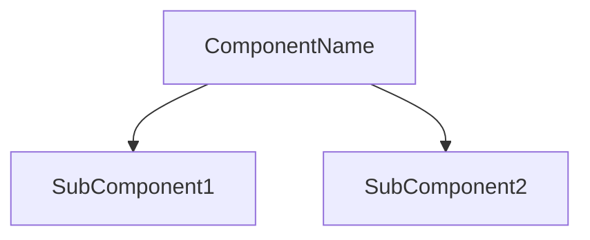
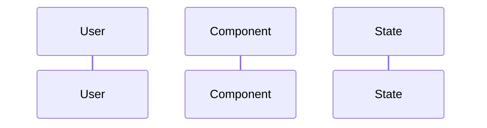
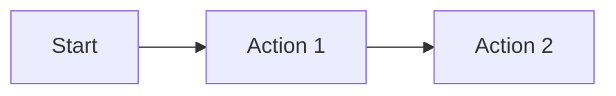

# ThriveSend Documentation Style Guide

## 1. Writing Style

### 1.1 Voice and Tone
- Use active voice and present tense
- Write in a clear, professional, and friendly tone
- Be direct and concise
- Use second person ("you") when addressing the reader

### 1.2 Language
- Use American English spelling
- Avoid jargon and technical terms without explanation
- Define acronyms on first use
- Use consistent terminology throughout

### 1.3 Formatting
- Use Markdown for all documentation
- Follow proper heading hierarchy (H1 → H2 → H3)
- Use bullet points for lists
- Use code blocks for code examples
- Use tables for structured data

## 2. Component Documentation Structure

### 2.1 Required Sections
```markdown
# ComponentName Component

## Overview
Brief description of the component's purpose and functionality

## Screenshots
Visual representation with appropriate captions

## Component Architecture


## Data Flow


## Features
- Feature 1
- Feature 2

## Props
| Name | Type | Required | Default | Description |
|------|------|----------|---------|-------------|
| prop1 | string | Yes | - | Description |

## Usage
```tsx
<ComponentName prop1="value" />
```

## User Interaction Workflow


## Components
Description of child components

## Data Models
```typescript
interface ComponentProps {
  // Props interface
}
```

## Styling
Description of styling approach

## Accessibility
A11y considerations

## Error Handling
How errors are managed

## Performance Optimizations
Performance enhancement strategies

## Dependencies
Required libraries

## Related Components
Links to associated components

## Examples
Comprehensive implementation examples

## Best Practices
Guidelines for effective use

## Troubleshooting
Common issues and solutions

## Contributing
Guidelines for modifying the component
```

## 3. Code Examples

### 3.1 TypeScript/React
- Use TypeScript for all code examples
- Include proper type definitions
- Show both basic and advanced usage
- Include error handling examples
- Document props and their types

### 3.2 Code Formatting
- Use Prettier configuration
- Follow project's ESLint rules
- Include comments for complex logic
- Use consistent naming conventions

## 4. Screenshots and Images

### 4.1 Requirements
- Resolution: 1200×800px minimum
- Format: PNG for UI, SVG for diagrams
- File naming: kebab-case (e.g., `component-main-view.png`)
- Include descriptive captions
- Show different states/views

### 4.2 Organization
- Store in `/DOCS/images/[component-category]/`
- Use relative paths in documentation
- Include alt text for accessibility

## 5. Diagrams

### 5.1 Mermaid Diagrams
- Use Mermaid for all diagrams
- Follow consistent styling
- Include clear labels
- Use appropriate diagram types

### 5.2 Diagram Types
- Component Architecture: `graph TD`
- Data Flow: `sequenceDiagram`
- User Flow: `graph LR`

## 6. Version Control

### 6.1 File Organization
- Follow established directory structure
- Use consistent file naming
- Keep related files together
- Maintain clear separation of concerns

### 6.2 Change Management
- Document breaking changes
- Update version numbers
- Maintain changelog
- Review and update related docs

## 7. Quality Assurance

### 7.1 Review Process
- Technical accuracy check
- Code example validation
- Link verification
- Screenshot validation
- Grammar and spelling check

### 7.2 Maintenance
- Regular content reviews
- Update outdated information
- Remove deprecated features
- Add new features and examples

## 8. Accessibility

### 8.1 Documentation
- Use proper heading structure
- Include alt text for images
- Ensure sufficient color contrast
- Provide text alternatives

### 8.2 Code Examples
- Include ARIA attributes
- Show keyboard navigation
- Document screen reader support
- Include focus management

## 9. Performance

### 9.1 Documentation
- Optimize images
- Minimize file sizes
- Use efficient Markdown
- Implement lazy loading

### 9.2 Code Examples
- Show performance best practices
- Include optimization techniques
- Document memory management
- Show caching strategies

## 10. Security

### 10.1 Documentation
- Document security considerations
- Include best practices
- Show secure coding patterns
- Document authentication flows

### 10.2 Code Examples
- Show secure implementations
- Include input validation
- Document error handling
- Show security patterns 