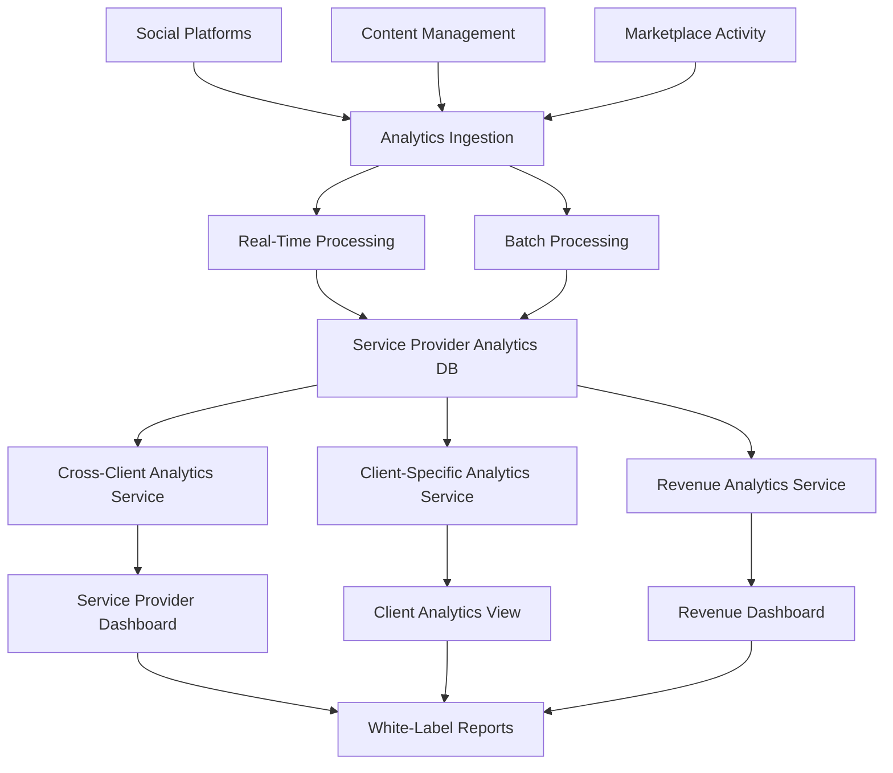

# Analytics Technical Design Document (TDD)
## ThriveSend B2B2G Service Provider Platform

### Document Information
- **Version**: 2.0.0  
- **Status**: ✅ PRD-COMPLIANT
- **Last Updated**: January 2025
- **Architecture**: Multi-Tenant B2B2G Service Provider Platform
- **Replaces**: Single-tenant analytics TDD (archived)

---

## 1. Executive Summary

### 1.1 Overview
The ThriveSend Analytics system provides comprehensive business intelligence for service providers managing multiple clients in a B2B2G (Business-to-Business-to-Government) model. The system enables digital agencies, consultants, and content creators to analyze performance across their entire client portfolio while generating specialized reports for individual clients.

### 1.2 Business Context
- **Primary Users**: Service providers managing 10-500+ clients
- **Secondary Users**: Individual clients receiving analytics reports
- **Key Differentiator**: Multi-client comparative analysis with government-specific metrics
- **Revenue Model**: Subscription tiers + marketplace commissions + white-label licensing

### 1.3 Architecture Principles
- **Multi-Tenant**: Service providers isolated with cross-client analytics capabilities
- **Real-Time**: Live dashboard updates and performance monitoring
- **Scalable**: Support for high-volume data processing across hundreds of clients
- **Compliant**: Government transparency and accessibility reporting requirements

---

## 2. User Requirements & Personas

### 2.1 Service Provider Administrator
**Goals**: Scale business, win government contracts, demonstrate ROI, optimize team productivity

**Analytics Requirements**:
- Cross-client performance dashboard with portfolio-wide metrics
- Client performance rankings and health scoring
- Revenue analytics including marketplace commissions
- Team productivity and resource utilization metrics
- Government tender success tracking and competitive analysis

### 2.2 Service Provider Content Manager
**Goals**: Create efficient content across multiple clients, optimize performance, manage workflows

**Analytics Requirements**:
- Comparative content performance across client portfolio
- Multi-platform engagement analysis per client
- Content type effectiveness by client sector (municipal vs. business)
- Workflow efficiency metrics and bottleneck identification
- Publishing optimization recommendations

### 2.3 Service Provider Account Manager
**Goals**: Monitor client health, identify growth opportunities, maintain high retention

**Analytics Requirements**:
- Client portfolio dashboard with health indicators
- Comparative client performance vs. benchmarks
- Upselling opportunity identification through analytics
- Client satisfaction tracking and churn risk assessment
- Communication and response time analytics

### 2.4 Independent Content Creator
**Goals**: Scale from freelance to platform business, compete for premium contracts

**Analytics Requirements**:
- Business growth analytics and client acquisition metrics
- Competitive benchmarking against other service providers
- Efficiency metrics for time-per-client optimization
- Value demonstration reports for client presentations
- Marketplace performance and revenue diversification tracking

---

## 3. System Architecture

### 3.1 High-Level Architecture

```typescript
// Analytics System Architecture
interface AnalyticsSystemArchitecture {
  // Data Layer
  dataIngestion: {
    sources: ['social_platforms', 'content_cms', 'marketplace', 'client_feedback'];
    processing: 'real_time_and_batch';
    storage: 'postgresql_with_timeseries';
  };
  
  // Service Layer
  analyticsServices: {
    crossClientAnalytics: ServiceProviderCrossClientService;
    clientSpecificAnalytics: ClientAnalyticsService;
    revenueAnalytics: RevenueAnalyticsService;
    marketplaceAnalytics: MarketplaceAnalyticsService;
    reportingService: WhiteLabelReportingService;
  };
  
  // Presentation Layer
  dashboards: {
    serviceProviderDashboard: ServiceProviderAnalyticsDashboard;
    clientSpecificView: ClientAnalyticsView;
    revenueManagement: RevenueAnalyticsDashboard;
    reportBuilder: WhiteLabelReportBuilder;
  };
}
```

### 3.2 Data Flow Architecture



### 3.3 Multi-Tenant Data Architecture

```sql
-- Service Provider Analytics Schema
CREATE TABLE service_provider_metrics (
    id UUID PRIMARY KEY,
    organization_id UUID REFERENCES organizations(id),
    metric_date DATE NOT NULL,
    total_clients INTEGER DEFAULT 0,
    active_clients INTEGER DEFAULT 0,
    total_campaigns INTEGER DEFAULT 0,
    active_campaigns INTEGER DEFAULT 0,
    total_revenue DECIMAL(12,2) DEFAULT 0,
    marketplace_revenue DECIMAL(12,2) DEFAULT 0,
    team_utilization_rate DECIMAL(5,2) DEFAULT 0,
    avg_client_satisfaction DECIMAL(3,2) DEFAULT 0,
    created_at TIMESTAMP DEFAULT CURRENT_TIMESTAMP,
    UNIQUE(organization_id, metric_date)
);

-- Cross-Client Analytics Schema  
CREATE TABLE cross_client_analytics (
    id UUID PRIMARY KEY,
    organization_id UUID REFERENCES organizations(id),
    metric_date DATE NOT NULL,
    total_content INTEGER DEFAULT 0,
    total_published_content INTEGER DEFAULT 0,
    aggregate_engagement_rate DECIMAL(5,2) DEFAULT 0,
    total_views BIGINT DEFAULT 0,
    total_clicks BIGINT DEFAULT 0,
    avg_conversion_rate DECIMAL(5,2) DEFAULT 0,
    content_type_distribution JSONB DEFAULT '{}',
    platform_distribution JSONB DEFAULT '{}',
    client_performance_summary JSONB DEFAULT '{}',
    insights JSONB DEFAULT '[]',
    created_at TIMESTAMP DEFAULT CURRENT_TIMESTAMP,
    UNIQUE(organization_id, metric_date)
);

-- Client-Specific Analytics Schema
CREATE TABLE client_analytics (
    id UUID PRIMARY KEY,
    client_id UUID REFERENCES clients(id),
    organization_id UUID REFERENCES organizations(id),
    metric_date DATE NOT NULL,
    content_metrics JSONB DEFAULT '{}',
    engagement_metrics JSONB DEFAULT '{}',
    platform_metrics JSONB DEFAULT '{}',
    audience_insights JSONB DEFAULT '{}',
    performance_score DECIMAL(5,2) DEFAULT 0,
    health_indicators JSONB DEFAULT '{}',
    created_at TIMESTAMP DEFAULT CURRENT_TIMESTAMP,
    UNIQUE(client_id, metric_date)
);

-- Client Performance Rankings Schema
CREATE TABLE client_performance_rankings (
    id UUID PRIMARY KEY,
    organization_id UUID REFERENCES organizations(id),
    client_id UUID REFERENCES clients(id),
    ranking_date DATE NOT NULL,
    overall_rank INTEGER,
    engagement_rank INTEGER,
    growth_rank INTEGER,
    revenue_rank INTEGER,
    performance_score DECIMAL(5,2),
    ranking_factors JSONB DEFAULT '{}',
    improvement_recommendations JSONB DEFAULT '[]',
    created_at TIMESTAMP DEFAULT CURRENT_TIMESTAMP,
    UNIQUE(organization_id, client_id, ranking_date)
);

-- Revenue Analytics Schema
CREATE TABLE revenue_analytics (
    id UUID PRIMARY KEY,
    organization_id UUID REFERENCES organizations(id),
    client_id UUID REFERENCES clients(id) NULL,
    revenue_date DATE NOT NULL,
    subscription_revenue DECIMAL(12,2) DEFAULT 0,
    marketplace_commission DECIMAL(12,2) DEFAULT 0,
    white_label_revenue DECIMAL(12,2) DEFAULT 0,
    total_revenue DECIMAL(12,2) DEFAULT 0,
    mrr DECIMAL(12,2) DEFAULT 0,
    client_ltv DECIMAL(12,2) DEFAULT 0,
    churn_risk_score DECIMAL(3,2) DEFAULT 0,
    revenue_sources JSONB DEFAULT '{}',
    created_at TIMESTAMP DEFAULT CURRENT_TIMESTAMP
);
```

---

## 4. Core Analytics Components

### 4.1 Service Provider Analytics Dashboard

**Component**: `ServiceProviderAnalyticsDashboard.tsx`

**Purpose**: Primary analytics interface for service providers to monitor their entire client portfolio and business performance.

**Key Features**:
- Cross-client performance overview with aggregate metrics
- Client performance rankings and health scoring
- Revenue analytics with multiple income streams
- Team productivity and resource utilization metrics
- Real-time alerts and performance notifications

**Data Requirements**:
```typescript
interface ServiceProviderAnalytics {
  organizationMetrics: {
    totalClients: number;
    activeClients: number;
    totalCampaigns: number;
    activeCampaigns: number;
    totalRevenue: number;
    marketplaceRevenue: number;
    teamUtilization: number;
    avgClientSatisfaction: number;
    growthMetrics: {
      clientGrowthRate: number;
      revenueGrowthRate: number;
      retentionRate: number;
    };
  };
  
  crossClientAnalytics: {
    aggregateMetrics: {
      totalContent: number;
      totalPublishedContent: number;
      averageEngagement: number;
      totalViews: number;
      totalClicks: number;
      averageConversionRate: number;
    };
    clientComparisons: ClientComparison[];
    performanceRankings: ClientRanking[];
    trendAnalysis: TrendData[];
    insights: AnalyticsInsight[];
  };
  
  revenueAnalytics: {
    subscriptionRevenue: number;
    marketplaceCommissions: number;
    whiteLabelRevenue: number;
    totalRevenue: number;
    mrr: number;
    clientLTV: number;
    revenueByClient: ClientRevenue[];
    revenueForecasting: RevenueForecast[];
  };
}
```

**UI Components**:
- Overview cards showing key business metrics
- Cross-client performance comparison charts
- Client performance rankings table
- Revenue breakdown and trend analysis
- Real-time activity feed
- Export and report generation controls

### 4.2 Cross-Client Analytics Component

**Component**: `CrossClientAnalytics.tsx`

**Purpose**: Enable service providers to compare performance across their entire client portfolio and identify trends, opportunities, and issues.

**Key Features**:
- Multi-client performance comparison with statistical analysis
- Trend analysis across client portfolio over time
- Distribution analysis by client type, industry, and performance metrics
- Correlation analysis between different performance factors
- Actionable insights and optimization recommendations

**Analytics Views**:
```typescript
interface CrossClientAnalyticsViews {
  performanceComparison: {
    clients: ClientPerformanceData[];
    metrics: ComparisonMetric[];
    visualizations: PerformanceChart[];
    statisticalAnalysis: StatisticalInsights;
  };
  
  trendAnalysis: {
    timeSeriesData: TimeSeriesPoint[];
    trendIndicators: TrendIndicator[];
    seasonalPatterns: SeasonalPattern[];
    forecasting: PerformanceForecast[];
  };
  
  distributionAnalysis: {
    contentTypeDistribution: ContentTypeMetrics[];
    platformDistribution: PlatformMetrics[];
    clientTypeDistribution: ClientTypeMetrics[];
    performanceDistribution: PerformanceDistribution;
  };
  
  correlationAnalysis: {
    engagementCorrelations: CorrelationMatrix;
    contentEffectiveness: ContentCorrelation[];
    clientFactorAnalysis: ClientFactorCorrelation[];
    optimizationOpportunities: OptimizationRecommendation[];
  };
}
```

### 4.3 Client Performance Rankings Component

**Component**: `ClientPerformanceRankings.tsx`

**Purpose**: Provide service providers with clear visibility into which clients are performing well and which need attention.

**Ranking Factors**:
- Overall performance score (weighted algorithm)
- Engagement rate rankings
- Growth trajectory rankings  
- Revenue contribution rankings
- Client satisfaction scores
- Content performance consistency

**Features**:
```typescript
interface ClientRankingSystem {
  rankingAlgorithm: {
    factors: RankingFactor[];
    weights: FactorWeight[];
    calculation: PerformanceScoreCalculation;
    benchmarking: IndustryBenchmarks;
  };
  
  performanceIndicators: {
    healthScore: ClientHealthScore;
    trendDirection: TrendDirection;
    riskAssessment: ChurnRiskAssessment;
    opportunityIdentification: GrowthOpportunity[];
  };
  
  actionableInsights: {
    improvementRecommendations: ActionableRecommendation[];
    upsellOpportunities: UpsellOpportunity[];
    retentionStrategies: RetentionStrategy[];
    benchmarkComparisons: BenchmarkComparison[];
  };
}
```

### 4.4 Revenue Analytics Dashboard

**Component**: `RevenueAnalyticsDashboard.tsx`

**Purpose**: Enable service providers to track and optimize their various revenue streams and understand the financial health of their business.

**Revenue Streams Analysis**:
- Subscription revenue from monthly client fees
- Marketplace commissions from boost recommendations
- White-label licensing revenue
- Performance bonus revenue
- Additional service revenue

**Financial Metrics**:
```typescript
interface RevenueAnalytics {
  primaryMetrics: {
    totalRevenue: number;
    mrr: number; // Monthly Recurring Revenue
    arr: number; // Annual Recurring Revenue
    clientLTV: number; // Customer Lifetime Value
    churnRate: number;
    revenueGrowthRate: number;
  };
  
  revenueBreakdown: {
    subscriptionRevenue: RevenueStream;
    marketplaceCommissions: RevenueStream;
    whiteLabelRevenue: RevenueStream;
    additionalServices: RevenueStream;
    revenueByClient: ClientRevenueBreakdown[];
  };
  
  profitabilityAnalysis: {
    grossMargin: number;
    clientAcquisitionCost: number;
    operatingExpenses: ExpenseBreakdown;
    profitByClient: ClientProfitability[];
    profitForecasting: ProfitForecast[];
  };
  
  businessIntelligence: {
    upsellOpportunities: UpsellOpportunity[];
    churnRiskAssessment: ChurnRiskClient[];
    marketExpansionOpportunities: MarketOpportunity[];
    competitivePositioning: CompetitiveAnalysis;
  };
}
```

### 4.5 White-Label Report Builder

**Component**: `WhiteLabelReportBuilder.tsx`

**Purpose**: Enable service providers to create professional, branded reports for their clients with customizable templates and automated generation.

**Report Types**:
- Executive summary reports for client leadership
- Detailed performance reports for marketing teams  
- Municipal transparency reports for government clients
- ROI demonstration reports for budget justification
- Competitive analysis reports
- Custom KPI tracking reports

**Customization Features**:
```typescript
interface WhiteLabelReporting {
  reportTemplates: {
    executiveSummary: ExecutiveReportTemplate;
    detailedAnalytics: DetailedReportTemplate;
    municipalCompliance: GovernmentReportTemplate;
    roiDemonstration: ROIReportTemplate;
    competitiveAnalysis: CompetitiveReportTemplate;
    customKPI: CustomReportTemplate;
  };
  
  brandingCustomization: {
    logoPlacement: LogoConfiguration;
    colorScheme: BrandColorScheme;
    fontSelection: Typography;
    headerFooterCustomization: HeaderFooterConfig;
    contactInformation: ContactConfig;
  };
  
  dataVisualization: {
    chartTypes: ChartTypeOption[];
    visualizationTemplates: VisualizationTemplate[];
    interactiveElements: InteractiveFeature[];
    exportFormats: ExportFormat[];
  };
  
  automationFeatures: {
    scheduledGeneration: ReportSchedule[];
    automaticDistribution: DistributionList[];
    triggerBasedReports: ReportTrigger[];
    templateManagement: TemplateManagement;
  };
}
```

---

## 5. API Architecture

### 5.1 Service Provider Analytics API

**Base Endpoint**: `/api/service-provider/analytics`

```typescript
// Cross-Client Analytics
GET /api/service-provider/analytics/cross-client
interface CrossClientAnalyticsRequest {
  organizationId: string;
  timeRange: '7d' | '30d' | '90d' | '1y';
  compareClients?: boolean;
  metrics?: string[];
}

interface CrossClientAnalyticsResponse {
  aggregateMetrics: AggregateMetrics;
  clientAnalytics: ServiceProviderClientAnalytics[];
  clientRankings: {
    byEngagement: ClientRanking[];
    byGrowth: ClientRanking[];
    byRevenue: ClientRanking[];
    byOverallPerformance: ClientRanking[];
  };
  contentTypeDistribution: Record<string, number>;
  platformDistribution: Record<string, number>;
  insights: AnalyticsInsight[];
  trends: TrendAnalysis[];
}

// Client-Specific Analytics  
GET /api/service-provider/analytics/client/:clientId
interface ClientAnalyticsRequest {
  organizationId: string;
  clientId: string;
  timeRange: '7d' | '30d' | '90d' | '1y';
  includeComparison?: boolean;
}

interface ClientAnalyticsResponse {
  clientAnalytics: ClientAnalytics;
  performanceData: PerformanceTimeSeriesData[];
  topContent: TopPerformingContent[];
  audienceInsights: AudienceInsights;
  competitorComparison?: CompetitorComparison;
  recommendations: OptimizationRecommendation[];
}

// Client Performance Comparison
POST /api/service-provider/analytics/compare
interface ClientComparisonRequest {
  organizationId: string;
  clientIds: string[];
  timeRange: '7d' | '30d' | '90d' | '1y';
  metrics: string[];
}

interface ClientComparisonResponse {
  comparisonData: ClientComparisonData[];
  statisticalAnalysis: StatisticalComparison;
  insights: ComparisonInsight[];
  recommendations: CrossClientRecommendation[];
}

// Revenue Analytics
GET /api/service-provider/analytics/revenue
interface RevenueAnalyticsRequest {
  organizationId: string;
  timeRange: '7d' | '30d' | '90d' | '1y';
  includeForecasting?: boolean;
}

interface RevenueAnalyticsResponse {
  revenueMetrics: RevenueMetrics;
  revenueBreakdown: RevenueBreakdown;
  clientRevenue: ClientRevenueAnalytics[];
  profitabilityAnalysis: ProfitabilityMetrics;
  revenueForecasting?: RevenueForecast[];
  businessIntelligence: BusinessIntelligenceInsights;
}
```

### 5.2 Reporting API

**Base Endpoint**: `/api/service-provider/reports`

```typescript
// White-Label Report Generation
POST /api/service-provider/reports/generate
interface ReportGenerationRequest {
  organizationId: string;
  clientId?: string; // Optional for cross-client reports
  reportType: 'executive' | 'detailed' | 'municipal' | 'roi' | 'competitive' | 'custom';
  timeRange: DateRange;
  customization: ReportCustomization;
  format: 'pdf' | 'html' | 'excel' | 'powerpoint';
}

interface ReportGenerationResponse {
  reportId: string;
  status: 'generating' | 'completed' | 'failed';
  downloadUrl?: string;
  estimatedCompletionTime?: number;
}

// Report Template Management
GET /api/service-provider/reports/templates
POST /api/service-provider/reports/templates
PUT /api/service-provider/reports/templates/:templateId
DELETE /api/service-provider/reports/templates/:templateId

// Report Scheduling
POST /api/service-provider/reports/schedule
interface ReportScheduleRequest {
  organizationId: string;
  reportConfig: ReportConfiguration;
  schedule: ScheduleConfiguration;
  recipients: RecipientConfiguration[];
  automationRules: AutomationRule[];
}

// Report Distribution
POST /api/service-provider/reports/distribute
interface ReportDistributionRequest {
  reportId: string;
  recipients: RecipientList[];
  distributionMethod: 'email' | 'dashboard' | 'api';
  customMessage?: string;
}
```

### 5.3 Real-Time Analytics API

**WebSocket Endpoint**: `/ws/service-provider/analytics`

```typescript
interface RealTimeAnalyticsEvents {
  // Performance Updates
  'performance_update': {
    organizationId: string;
    clientId?: string;
    metrics: RealTimeMetrics;
    timestamp: Date;
  };
  
  // Alerts and Notifications
  'performance_alert': {
    organizationId: string;
    alertType: 'threshold' | 'anomaly' | 'trend';
    severity: 'low' | 'medium' | 'high' | 'critical';
    description: string;
    affectedClients: string[];
    recommendedActions: string[];
  };
  
  // Client Activity Updates
  'client_activity': {
    organizationId: string;
    clientId: string;
    activityType: string;
    activityData: any;
    timestamp: Date;
  };
  
  // Revenue Updates
  'revenue_update': {
    organizationId: string;
    revenueStream: string;
    amount: number;
    clientId?: string;
    timestamp: Date;
  };
}
```

---

### 5.4 External Integrations API

```typescript
// Social Platform Analytics Integration
GET /api/service-provider/integrations/platforms/:platform/analytics
interface PlatformAnalyticsRequest {
  organizationId: string;
  clientId: string;
  platform: 'facebook' | 'twitter' | 'instagram' | 'linkedin';
  timeRange: DateRange;
  metrics: string[];
}

// Government Compliance Reporting
GET /api/service-provider/compliance/municipal-reporting
interface MunicipalReportingRequest {
  organizationId: string;
  municipalClientId: string;
  reportingPeriod: DateRange;
  complianceRequirements: ComplianceRequirement[];
}

// Competitive Benchmarking
GET /api/service-provider/benchmarking/industry
interface IndustryBenchmarkingRequest {
  organizationId: string;
  industryType: string;
  clientSize: 'small' | 'medium' | 'large';
  metrics: string[];
}
```

---

## 6. Data Models & Types

### 6.1 Core Analytics Types

```typescript
// Service Provider Analytics Types
interface ServiceProviderMetrics {
  organizationId: string;
  totalClients: number;
  activeClients: number;
  totalCampaigns: number;
  activeCampaigns: number;
  totalRevenue: number;
  marketplaceRevenue: number;
  teamUtilization: number;
  avgClientSatisfaction: number;
  growthMetrics: GrowthMetrics;
  updatedAt: Date;
}

interface GrowthMetrics {
  clientGrowthRate: number;
  revenueGrowthRate: number;
  retentionRate: number;
  acquisitionRate: number;
  churnRate: number;
}

// Cross-Client Analytics Types
interface CrossClientAnalytics {
  organizationId: string;
  aggregateMetrics: AggregateMetrics;
  clientAnalytics: ServiceProviderClientAnalytics[];
  clientRankings: ClientRankings;
  contentTypeDistribution: Record<string, number>;
  platformDistribution: Record<string, number>;
  insights: AnalyticsInsight[];
  trendAnalysis: TrendAnalysis[];
}

interface AggregateMetrics {
  totalClients: number;
  totalContent: number;
  totalPublishedContent: number;
  averageEngagement: number;
  totalViews: number;
  totalClicks: number;
  averageConversionRate: number;
}

interface ServiceProviderClientAnalytics {
  clientId: string;
  clientName: string;
  clientType: 'municipality' | 'business' | 'startup' | 'nonprofit';
  contentMetrics: ContentMetrics;
  engagementMetrics: EngagementMetrics;
  performanceScore: number;
  healthIndicators: ClientHealthIndicators;
  trendDirection: 'up' | 'down' | 'stable';
}

interface ContentMetrics {
  totalContent: number;
  publishedContent: number;
  draftContent: number;
  avgEngagementRate: number;
  totalViews: number;
  totalClicks: number;
  conversionRate: number;
  contentTypeBreakdown: Record<string, number>;
}

interface EngagementMetrics {
  engagementRate: number;
  engagementGrowth: number;
  averageEngagementPerPost: number;
  peakEngagementTimes: TimeSlot[];
  engagementByPlatform: Record<string, number>;
  audienceGrowthRate: number;
}
```

### 6.2 Client Performance & Rankings

```typescript
interface ClientRankings {
  byEngagement: ClientRanking[];
  byGrowth: ClientRanking[];
  byRevenue: ClientRanking[];
  byOverallPerformance: ClientRanking[];
}

interface ClientRanking {
  clientId: string;
  clientName: string;
  rank: number;
  score: number;
  previousRank?: number;
  rankChange: number;
  performanceIndicators: PerformanceIndicator[];
}

interface PerformanceIndicator {
  metric: string;
  value: number;
  benchmark: number;
  status: 'excellent' | 'good' | 'average' | 'poor';
  trend: 'improving' | 'declining' | 'stable';
}

interface ClientHealthIndicators {
  healthScore: number; // 0-100
  riskFactors: RiskFactor[];
  opportunities: Opportunity[];
  retentionRisk: 'low' | 'medium' | 'high';
  satisfactionScore: number;
  engagementTrend: TrendDirection;
}

interface RiskFactor {
  type: 'engagement_decline' | 'low_satisfaction' | 'billing_issues' | 'communication_gap';
  severity: 'low' | 'medium' | 'high';
  description: string;
  recommendedActions: string[];
}

interface Opportunity {
  type: 'upsell' | 'cross_sell' | 'service_expansion' | 'performance_improvement';
  potentialValue: number;
  probability: number;
  description: string;
  actionPlan: string[];
}
```

### 6.3 Revenue Analytics Types

```typescript
interface RevenueAnalytics {
  organizationId: string;
  revenueMetrics: RevenueMetrics;
  revenueBreakdown: RevenueBreakdown;
  clientRevenue: ClientRevenueAnalytics[];
  profitabilityAnalysis: ProfitabilityMetrics;
  revenueForecasting: RevenueForecast[];
  businessIntelligence: BusinessIntelligenceInsights;
}

interface RevenueMetrics {
  totalRevenue: number;
  mrr: number; // Monthly Recurring Revenue
  arr: number; // Annual Recurring Revenue
  clientLTV: number; // Customer Lifetime Value
  churnRate: number;
  revenueGrowthRate: number;
  revenuePerClient: number;
  profitMargin: number;
}

interface RevenueBreakdown {
  subscriptionRevenue: RevenueStream;
  marketplaceCommissions: RevenueStream;
  whiteLabelRevenue: RevenueStream;
  additionalServices: RevenueStream;
  totalRevenue: number;
}

interface RevenueStream {
  amount: number;
  percentage: number;
  growthRate: number;
  trend: TrendDirection;
  forecasting: number[];
}

interface ClientRevenueAnalytics {
  clientId: string;
  clientName: string;
  totalRevenue: number;
  monthlyRevenue: number;
  revenueGrowth: number;
  profitability: number;
  ltv: number;
  acquisitionCost: number;
  retentionProbability: number;
}

interface BusinessIntelligenceInsights {
  upsellOpportunities: UpsellOpportunity[];
  churnRiskAssessment: ChurnRiskClient[];
  marketExpansionOpportunities: MarketOpportunity[];
  competitivePositioning: CompetitiveAnalysis;
  profitabilityOptimization: ProfitabilityRecommendation[];
}
```

### 6.4 Reporting & Export Types

```typescript
interface WhiteLabelReport {
  reportId: string;
  organizationId: string;
  clientId?: string;
  reportType: ReportType;
  customization: ReportCustomization;
  generatedAt: Date;
  format: ReportFormat;
  downloadUrl: string;
  expiresAt: Date;
}

interface ReportCustomization {
  branding: BrandingConfiguration;
  dataSelection: DataSelectionConfig;
  visualizationPreferences: VisualizationConfig;
  layoutOptions: LayoutConfiguration;
}

interface BrandingConfiguration {
  logo: LogoConfig;
  colorScheme: ColorScheme;
  typography: TypographyConfig;
  headerFooter: HeaderFooterConfig;
  contactInfo: ContactConfiguration;
}

interface DataSelectionConfig {
  timeRange: DateRange;
  metrics: string[];
  clients: string[];
  platforms: string[];
  contentTypes: string[];
  customFilters: FilterConfiguration[];
}

interface VisualizationConfig {
  chartTypes: ChartTypePreference[];
  colorPalette: string[];
  chartSizing: ChartSizeConfig;
  interactiveElements: boolean;
  exportFriendly: boolean;
}
```

### 6.5 Real-Time Analytics Types

```typescript
interface RealTimeMetrics {
  organizationId: string;
  clientId?: string;
  timestamp: Date;
  liveMetrics: LiveMetricSet;
  alerts: PerformanceAlert[];
  activities: RecentActivity[];
}

interface LiveMetricSet {
  activeUsers: number;
  realTimeEngagement: number;
  liveConversions: number;
  currentRevenue: number;
  activeAlerts: number;
  systemHealth: SystemHealthMetric[];
}

interface PerformanceAlert {
  id: string;
  type: 'threshold' | 'anomaly' | 'trend' | 'system';
  severity: 'low' | 'medium' | 'high' | 'critical';
  title: string;
  description: string;
  affectedMetrics: string[];
  affectedClients: string[];
  recommendedActions: RecommendedAction[];
  timestamp: Date;
  acknowledged: boolean;
}

interface RecommendedAction {
  action: string;
  priority: 'low' | 'medium' | 'high';
  estimatedImpact: string;
  timeToImplement: string;
  resources: string[];
}

interface RecentActivity {
  id: string;
  type: 'content_published' | 'campaign_started' | 'client_activity' | 'revenue_generated';
  description: string;
  clientId?: string;
  clientName?: string;
  impact: ActivityImpact;
  timestamp: Date;
}

interface ActivityImpact {
  metric: string;
  value: number;
  change: number;
  significance: 'low' | 'medium' | 'high';
}
```

---

## 7. Implementation Requirements

### 7.1 Performance Requirements

**Dashboard Load Times**:
- Service Provider Dashboard: < 800ms initial load
- Cross-Client Analytics: < 500ms for comparative analysis
- Client-Specific Views: < 300ms for individual client data
- Real-Time Updates: < 100ms latency for live metrics

**Scalability Requirements**:
- Support 500+ clients per service provider organization
- Handle 10M+ data points per month across all clients
- Process real-time updates for 100+ concurrent users
- Generate reports for 1000+ clients within 5 minutes

**Data Processing**:
- Batch processing: Complete within 15-minute windows
- Real-time processing: < 1 second latency for critical metrics
- Report generation: < 3 seconds for standard reports, < 10 seconds for complex reports
- Export handling: Support large datasets without timeout

### 7.2 Security & Compliance Requirements

**Data Security**:
- Multi-tenant data isolation with row-level security
- Encryption at rest and in transit for all analytics data
- Role-based access control with granular permissions
- Audit logging for all analytics data access and modifications

**Government Compliance**:
- GDPR compliance for international municipal clients
- Accessibility compliance (WCAG 2.1 AA) for government reports
- Data retention policies aligned with municipal requirements
- Transparency reporting capabilities for government clients

**API Security**:
- JWT-based authentication with refresh token rotation
- Rate limiting per organization and user tier
- Input validation and sanitization for all analytics queries
- API versioning to maintain backward compatibility

### 7.3 Integration Requirements

**Social Platform Integrations**:
- Facebook Business API for page and post analytics
- Twitter API v2 for tweet and account performance
- Instagram Basic Display API for business insights
- LinkedIn Marketing API for company page analytics
- YouTube Analytics API for video performance

**Data Synchronization**:
- Real-time webhooks from social platforms when available
- Scheduled batch imports for platforms without real-time capabilities
- Conflict resolution for duplicate or conflicting data
- Data validation and quality checks on all imported data

**External Analytics Tools**:
- Google Analytics integration for website traffic correlation
- Municipal platform APIs for government-specific metrics
- CRM integration for client relationship data
- Financial system integration for revenue reconciliation

### 7.4 Testing Requirements

**Unit Testing**:
- 90% code coverage for analytics calculation functions
- Mock data generators for consistent testing across components
- Performance testing for database queries and calculations
- Edge case testing for data validation and error handling

**Integration Testing**:
- End-to-end testing for complete analytics workflows
- API testing for all service provider analytics endpoints
- Social platform integration testing with mock APIs
- Report generation testing with various data scenarios

**Performance Testing**:
- Load testing with 500+ concurrent users
- Stress testing with maximum client capacity per organization
- Database performance testing with large datasets
- Report generation performance under high load

**User Acceptance Testing**:
- Service provider workflow testing with real user scenarios
- Client report generation and customization testing
- Cross-client analytics accuracy validation
- Real-time updates and alert system testing

---

## 8. Deployment & Operations

### 8.1 Environment Configuration

**Production Environment**:
- PostgreSQL with TimescaleDB extension for time-series data
- Redis for caching frequently accessed analytics data
- WebSocket server for real-time analytics updates
- CDN for static assets and generated reports

**Analytics Data Pipeline**:
- ETL processes for social platform data ingestion
- Data warehouse setup for historical analytics storage
- Automated data quality monitoring and alerting
- Backup and disaster recovery for analytics databases

**Monitoring & Alerting**:
- Application performance monitoring with detailed analytics metrics
- Database performance monitoring with query optimization alerts
- Real-time system health monitoring with automated failover
- User behavior analytics to optimize dashboard performance

### 8.2 Deployment Strategy

**Phased Rollout**:
1. **Phase 1**: Service provider dashboard with basic cross-client analytics
2. **Phase 2**: Client performance rankings and revenue analytics
3. **Phase 3**: White-label reporting and advanced features
4. **Phase 4**: Real-time analytics and predictive insights

**Feature Flags**:
- Gradual rollout of new analytics features
- A/B testing for dashboard UI/UX improvements
- Client-specific feature enablement based on subscription tier
- Emergency feature disable capabilities for critical issues

**Migration Strategy**:
- Data migration from existing analytics systems
- Gradual transition from old analytics to new B2B2G system
- Backward compatibility for existing API consumers
- Training materials and documentation for service providers

---

## 9. Success Metrics & KPIs

### 9.1 Technical Performance KPIs

**System Performance**:
- Dashboard load time: < 800ms (target), < 1.2s (acceptable)
- API response time: < 200ms (target), < 500ms (acceptable)
- System uptime: 99.9% availability
- Data accuracy: 99.5% accuracy across all metrics

**User Engagement**:
- Daily active users (service providers): Track adoption rates
- Feature utilization: Monitor which analytics features are most used
- Report generation frequency: Track client report generation patterns
- User session duration: Measure depth of analytics engagement

### 9.2 Business Impact KPIs

**Service Provider Success**:
- Client retention improvement: Target 20% increase
- Revenue growth correlation: Track revenue impact from analytics insights
- Time savings: Measure efficiency gains from automated analytics
- Client acquisition: Track new client wins attributed to analytics capabilities

**Client Satisfaction**:
- White-label report satisfaction scores from service provider clients
- Analytics-driven performance improvements for end clients
- Government compliance report success rates
- Client testimonials and case studies featuring analytics value

### 9.3 Platform Growth KPIs

**Adoption Metrics**:
- Service provider onboarding completion rates
- Time-to-first-value: Time from signup to first meaningful analytics insight
- Feature adoption curves: Track uptake of advanced analytics features
- Support ticket volume: Monitor analytics-related support requests

**Revenue Impact**:
- Analytics feature correlation with subscription tier upgrades
- Marketplace commission revenue driven by analytics recommendations
- White-label licensing revenue from analytics capabilities
- Customer lifetime value improvement attributed to analytics

---

## 10. Future Enhancements

### 10.1 Advanced Analytics Features

**Predictive Analytics**:
- Machine learning models for content performance prediction
- Client churn prediction with early warning systems
- Revenue forecasting with seasonal adjustment algorithms
- Audience growth prediction and optimization recommendations

**AI-Powered Insights**:
- Natural language generation for automated insight descriptions
- Anomaly detection with intelligent alerting and root cause analysis
- Competitive intelligence through social media monitoring
- Content optimization recommendations based on performance patterns

### 10.2 Platform Extensions

**Mobile Analytics App**:
- Native mobile app for service providers to monitor key metrics
- Push notifications for critical alerts and performance milestones
- Offline capabilities for viewing cached analytics data
- Mobile-optimized report sharing and client communication

**Advanced Integrations**:
- Integration with additional social platforms (TikTok, Pinterest, Snapchat)
- CRM deep integration for complete client relationship analytics
- Marketing automation platform connections for campaign correlation
- Financial system integration for complete ROI and profitability analysis

### 10.3 Enterprise Features

**White-Label Platform**:
- Complete white-label analytics platform for enterprise service providers
- Custom domain hosting for client-facing analytics portals
- API licensing for service providers to integrate analytics into their own systems
- Custom branding and feature configuration for enterprise accounts

**Advanced Compliance**:
- Additional government compliance frameworks (SOC 2, HIPAA for health-related municipal services)
- International compliance standards for global service providers
- Advanced audit trails and compliance reporting automation
- Data sovereignty controls for government clients with strict data residency requirements

---

## 11. Conclusion

This Analytics Technical Design Document provides a comprehensive blueprint for implementing a B2B2G service provider analytics platform that enables digital agencies, consultants, and content creators to scale their businesses through data-driven insights and multi-client management capabilities.

The design prioritizes:
- **Multi-tenant architecture** supporting service providers with hundreds of clients
- **Cross-client analytics** enabling portfolio-level business intelligence
- **Government-specific features** for B2B2G market differentiation  
- **Revenue optimization** through multiple monetization streams
- **White-label capabilities** for service provider client presentations
- **Real-time insights** for proactive client management

Implementation of this design will transform ThriveSend from a single-tenant social media tool into a comprehensive B2B2G service provider platform that captures significant market share in the government and municipal social media management sector.

**Next Steps**:
1. Begin implementation with Service Provider Dashboard (Phase 1)
2. Develop Cross-Client Analytics core functionality (Phase 2) 
3. Implement Revenue Analytics and Client Rankings (Phase 3)
4. Build White-Label Reporting system (Phase 4)
5. Add Real-Time Analytics and Advanced Features (Phase 5)

This TDD serves as the definitive technical specification for building analytics that align with ThriveSend's B2B2G business model and market positioning.

---

*Document approved for implementation*  
*Technical Review: ✅ Completed*  
*Business Alignment: ✅ PRD Compliant*  
*Architecture Review: ✅ Scalable Multi-Tenant Design*