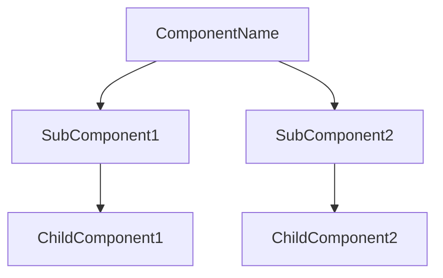
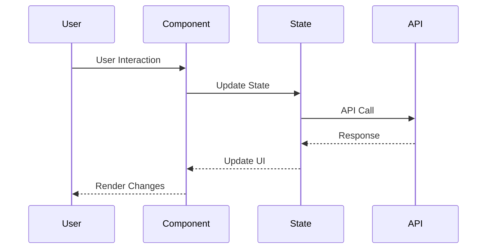
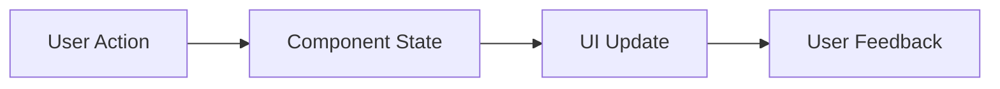

# [ComponentName] Component

## Overview
[Brief description of the component's purpose and functionality]

## Screenshots

*Main view of the component*


*Different states of the component*

## Component Architecture


## Data Flow


## Features
- Feature 1: Description
- Feature 2: Description
- Feature 3: Description

## Props
| Name | Type | Required | Default | Description |
|------|------|----------|---------|-------------|
| prop1 | string | Yes | - | Description |
| prop2 | number | No | 0 | Description |
| prop3 | boolean | No | false | Description |

## Usage
```tsx
import { ComponentName } from '@/components/[category]/ComponentName';

// Basic usage
<ComponentName prop1="value" />

// Advanced usage
<ComponentName
  prop1="value"
  prop2={42}
  prop3={true}
  onChange={(value) => console.log(value)}
/>
```

## User Interaction Workflow


## Components

### SubComponent1
Description of SubComponent1 and its purpose

### SubComponent2
Description of SubComponent2 and its purpose

## Data Models
```typescript
interface ComponentProps {
  prop1: string;
  prop2?: number;
  prop3?: boolean;
  onChange?: (value: any) => void;
}

interface ComponentState {
  // State interface
}

interface ComponentEvent {
  // Event interface
}
```

## Styling
- Uses Tailwind CSS classes
- Follows design system tokens
- Responsive design patterns
- Dark mode support
- Custom theme support

## Accessibility
- ARIA labels and roles
- Keyboard navigation
- Screen reader support
- Focus management
- Color contrast compliance

## Error Handling
- Input validation
- Error states
- Error messages
- Recovery options
- Fallback UI

## Performance Optimizations
- Memoization
- Lazy loading
- Code splitting
- Bundle optimization
- Render optimization

## Dependencies
- React
- TypeScript
- Tailwind CSS
- [Other dependencies]

## Related Components
- [Link to related component 1]
- [Link to related component 2]
- [Link to related component 3]

## Examples

### Basic Example
```tsx
import { ComponentName } from '@/components/[category]/ComponentName';

export function BasicExample() {
  return (
    <ComponentName
      prop1="value"
      onChange={(value) => console.log(value)}
    />
  );
}
```

### Advanced Example
```tsx
import { ComponentName } from '@/components/[category]/ComponentName';
import { useCallback, useState } from 'react';

export function AdvancedExample() {
  const [value, setValue] = useState('');
  
  const handleChange = useCallback((newValue: string) => {
    setValue(newValue);
    // Additional logic
  }, []);

  return (
    <ComponentName
      prop1={value}
      prop2={42}
      prop3={true}
      onChange={handleChange}
    />
  );
}
```

## Best Practices

### Usage Guidelines
- Guideline 1
- Guideline 2
- Guideline 3

### Performance Tips
- Tip 1
- Tip 2
- Tip 3

### Security Considerations
- Consideration 1
- Consideration 2
- Consideration 3

## Troubleshooting

### Common Issues
| Issue | Solution |
|-------|----------|
| Issue 1 | Solution 1 |
| Issue 2 | Solution 2 |
| Issue 3 | Solution 3 |

### Error Messages
| Error Code | Description | Resolution |
|------------|-------------|------------|
| ERR001 | Description | Resolution steps |
| ERR002 | Description | Resolution steps |
| ERR003 | Description | Resolution steps |

## Contributing

### Development Setup
1. Step 1
2. Step 2
3. Step 3

### Testing
```typescript
import { render, screen } from '@testing-library/react';
import { ComponentName } from './ComponentName';

describe('ComponentName', () => {
  it('renders correctly', () => {
    render(<ComponentName prop1="value" />);
    expect(screen.getByText('value')).toBeInTheDocument();
  });
});
```

### Code Style
- Follow TypeScript best practices
- Use ESLint rules
- Follow Prettier configuration
- Write meaningful comments
- Use proper naming conventions

## Changelog

### Version 1.0.0
- Initial release
- Feature 1
- Feature 2

### Version 1.1.0
- New feature
- Bug fixes
- Improvements

## Appendix

### Glossary
- Term 1: Definition
- Term 2: Definition
- Term 3: Definition

### FAQ
#### Question 1?
Answer 1

#### Question 2?
Answer 2

#### Question 3?
Answer 3 