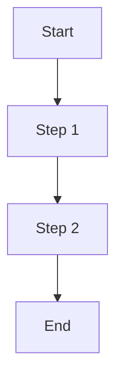

# [Feature Name] User Guide

## Overview
[Brief description of the feature and its purpose]

## Prerequisites
- Required permissions
- System requirements
- Dependencies
- Access levels

## Getting Started

### Accessing the Feature
1. Navigate to [location]
2. Click [button/link]
3. Follow [steps]

### Basic Navigation
- Main interface elements
- Key controls
- Navigation patterns
- Common actions

## Core Features

### Feature 1
#### Description
[Detailed description]

#### How to Use
1. Step 1
2. Step 2
3. Step 3

#### Examples
```typescript
// Code example if applicable
```

### Feature 2
#### Description
[Detailed description]

#### How to Use
1. Step 1
2. Step 2
3. Step 3

#### Examples
```typescript
// Code example if applicable
```

## Advanced Features

### Advanced Feature 1
#### Description
[Detailed description]

#### Configuration
- Setting 1
- Setting 2
- Setting 3

#### Best Practices
- Tip 1
- Tip 2
- Tip 3

### Advanced Feature 2
#### Description
[Detailed description]

#### Configuration
- Setting 1
- Setting 2
- Setting 3

#### Best Practices
- Tip 1
- Tip 2
- Tip 3

## Workflows

### Common Workflow 1


### Common Workflow 2


## Integration

### API Integration
#### Endpoints
- `GET /api/endpoint`
- `POST /api/endpoint`
- `PUT /api/endpoint`
- `DELETE /api/endpoint`

#### Authentication
[Authentication requirements and methods]

#### Rate Limits
[Rate limiting information]

### Third-Party Integrations
- Integration 1
- Integration 2
- Integration 3

## Security

### Access Control
- Role-based permissions
- Access levels
- Security requirements

### Data Protection
- Data encryption
- Privacy considerations
- Compliance requirements

## Performance

### Optimization
- Performance tips
- Best practices
- Resource usage

### Monitoring
- Performance metrics
- Monitoring tools
- Alert thresholds

## Troubleshooting

### Common Issues
| Issue | Solution |
|-------|----------|
| Issue 1 | Solution 1 |
| Issue 2 | Solution 2 |
| Issue 3 | Solution 3 |

### Error Messages
| Error Code | Description | Resolution |
|------------|-------------|------------|
| ERR001 | Description | Resolution steps |
| ERR002 | Description | Resolution steps |
| ERR003 | Description | Resolution steps |

## Best Practices

### General Guidelines
- Guideline 1
- Guideline 2
- Guideline 3

### Performance Tips
- Tip 1
- Tip 2
- Tip 3

### Security Recommendations
- Recommendation 1
- Recommendation 2
- Recommendation 3

## Examples

### Basic Example
```typescript
// Basic implementation example
```

### Advanced Example
```typescript
// Advanced implementation example
```

## Reference

### Keyboard Shortcuts
| Shortcut | Action |
|----------|--------|
| Ctrl+S | Save |
| Ctrl+P | Print |
| Ctrl+Z | Undo |

### Configuration Options
| Option | Type | Default | Description |
|--------|------|---------|-------------|
| Option 1 | string | default | Description |
| Option 2 | number | 0 | Description |
| Option 3 | boolean | false | Description |

### API Reference
#### Endpoint 1
```typescript
interface Endpoint1Request {
  // Request interface
}

interface Endpoint1Response {
  // Response interface
}
```

#### Endpoint 2
```typescript
interface Endpoint2Request {
  // Request interface
}

interface Endpoint2Response {
  // Response interface
}
```

## Related Resources

### Documentation
- [Link to related guide 1]
- [Link to related guide 2]
- [Link to related guide 3]

### External Resources
- [External resource 1]
- [External resource 2]
- [External resource 3]

## Support

### Getting Help
- Support channels
- Contact information
- Response times

### Feedback
- Feedback process
- Feature requests
- Bug reports

## Changelog

### Version 1.0.0
- Initial release
- Feature 1
- Feature 2

### Version 1.1.0
- New feature
- Bug fixes
- Improvements

## Appendix

### Glossary
- Term 1: Definition
- Term 2: Definition
- Term 3: Definition

### FAQ
#### Question 1?
Answer 1

#### Question 2?
Answer 2

#### Question 3?
Answer 3 