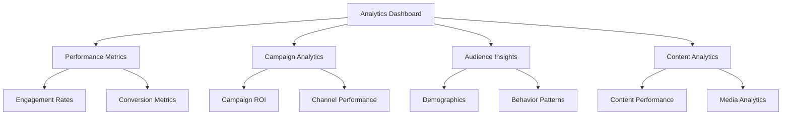

# Analytics Dashboard Guide

## Overview

The Analytics Dashboard provides real-time insights into your content performance, campaign metrics, and audience engagement. This guide will help you understand and utilize all dashboard features effectively.



## Getting Started

### Prerequisites
- Active ThriveSend account
- Content or campaigns in the system
- Appropriate access permissions

### Initial Setup

```typescript
interface DashboardConfig {
  refreshInterval: number;
  defaultTimeRange: TimeRange;
  metrics: Metric[];
  widgets: Widget[];
}

// Example configuration
const dashboardConfig: DashboardConfig = {
  refreshInterval: 300, // 5 minutes
  defaultTimeRange: 'last7days',
  metrics: ['engagement', 'conversion', 'reach'],
  widgets: ['performance', 'audience', 'content']
};
```

## Interactive Dashboard Tour

### 1. Performance Overview
<div class="interactive-card">
  <h3>Key Metrics</h3>
  <div class="metric-grid">
    <div class="metric-card">
      <span class="metric-value">85%</span>
      <span class="metric-label">Engagement Rate</span>
    </div>
    <div class="metric-card">
      <span class="metric-value">1.2M</span>
      <span class="metric-label">Total Reach</span>
    </div>
    <div class="metric-card">
      <span class="metric-value">3.5x</span>
      <span class="metric-label">ROI</span>
    </div>
  </div>
  <button class="try-it-btn">Try It</button>
</div>

### 2. Campaign Analytics
<div class="interactive-chart">
  <h3>Campaign Performance</h3>
  <div class="chart-container">
    <!-- Chart will be rendered here -->
  </div>
  <div class="chart-controls">
    <select class="time-range">
      <option value="24h">Last 24 Hours</option>
      <option value="7d">Last 7 Days</option>
      <option value="30d">Last 30 Days</option>
    </select>
    <button class="export-btn">Export Data</button>
  </div>
</div>

## Advanced Features

### Custom Reports
```typescript
interface ReportConfig {
  name: string;
  metrics: string[];
  filters: Filter[];
  schedule?: Schedule;
  recipients: string[];
}

// Example report configuration
const customReport: ReportConfig = {
  name: 'Weekly Performance',
  metrics: ['engagement', 'conversion', 'reach'],
  filters: [
    { type: 'dateRange', value: 'last7days' },
    { type: 'campaign', value: 'active' }
  ],
  schedule: {
    frequency: 'weekly',
    day: 'monday',
    time: '09:00'
  },
  recipients: ['team@example.com']
};
```

### Real-time Analytics
<div class="realtime-demo">
  <h3>Live Data Stream</h3>
  <div class="data-stream">
    <!-- Real-time data will be displayed here -->
  </div>
  <div class="controls">
    <button class="pause-btn">Pause</button>
    <button class="refresh-btn">Refresh</button>
  </div>
</div>

## Best Practices

### Performance Optimization
1. Use appropriate time ranges
2. Enable data caching
3. Schedule heavy reports
4. Use filters effectively

### Data Interpretation
1. Compare against benchmarks
2. Track trends over time
3. Segment data appropriately
4. Consider external factors

## Troubleshooting

<div class="troubleshooting-cards">
  <div class="trouble-card">
    <h4>Data Not Updating</h4>
    <p>Check your refresh settings and internet connection</p>
    <button class="try-fix">Try Fix</button>
  </div>
  <div class="trouble-card">
    <h4>Slow Loading</h4>
    <p>Reduce time range or number of metrics</p>
    <button class="try-fix">Try Fix</button>
  </div>
</div>

## Related Resources

- [Campaign Analytics Guide](./campaign-analytics.md)
- [Content Performance Guide](./content-performance.md)
- [Audience Insights Guide](./audience-insights.md)

## Styling

```css
/* Dashboard Styles */
.dashboard-container {
  display: grid;
  grid-template-columns: repeat(auto-fit, minmax(300px, 1fr));
  gap: 1.5rem;
  padding: 1.5rem;
}

.metric-card {
  background: var(--light);
  border-radius: 8px;
  padding: 1rem;
  transition: transform 0.2s;
}

.metric-card:hover {
  transform: translateY(-2px);
}

.interactive-chart {
  background: white;
  border-radius: 12px;
  box-shadow: 0 2px 4px rgba(0,0,0,0.1);
  padding: 1.5rem;
}

/* Dark Mode Support */
@media (prefers-color-scheme: dark) {
  .metric-card {
    background: var(--dark);
    color: var(--light);
  }
  
  .interactive-chart {
    background: var(--dark);
    color: var(--light);
  }
}

/* Responsive Design */
@media (max-width: 768px) {
  .dashboard-container {
    grid-template-columns: 1fr;
  }
}
``` 