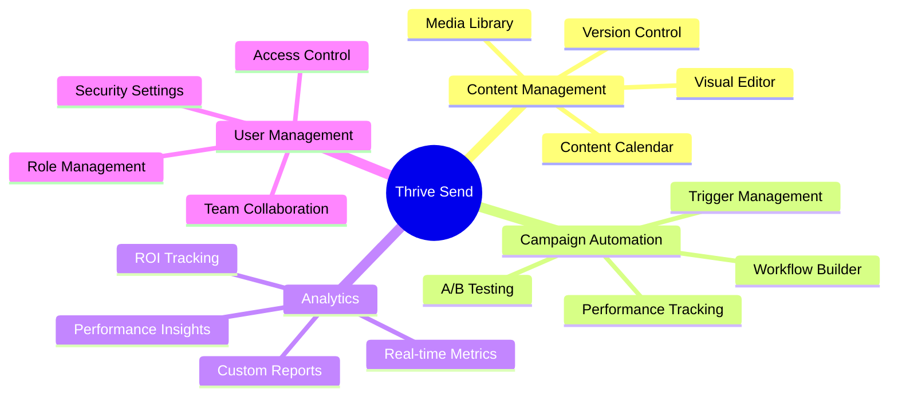

# Getting Started with Thrive Send

## Overview
Thrive Send is your all-in-one marketing automation platform, designed to streamline your content creation, campaign management, and analytics. This guide will help you get up and running quickly.

## Quick Start
<div class="quick-start-cards">
  <div class="card">
    <h3>1. Create Account</h3>
    <p>Sign up and verify your email</p>
    <button class="try-it">Try it →</button>
  </div>
  <div class="card">
    <h3>2. Initial Setup</h3>
    <p>Configure your workspace</p>
    <button class="try-it">Try it →</button>
  </div>
  <div class="card">
    <h3>3. First Campaign</h3>
    <p>Launch your first campaign</p>
    <button class="try-it">Try it →</button>
  </div>
</div>

## Key Features
```typescript
interface PlatformFeatures {
  contentManagement: {
    editor: string[];
    media: string[];
    workflow: string[];
  };
  campaignAutomation: {
    creation: string[];
    scheduling: string[];
    analytics: string[];
  };
  analytics: {
    metrics: string[];
    reports: string[];
    insights: string[];
  };
}
```

### Interactive Feature Map


## Detailed Guide

### 1. Account Setup
```typescript
interface AccountSetup {
  steps: {
    signUp: {
      email: string;
      password: string;
      company: string;
    };
    verification: {
      email: boolean;
      phone: boolean;
      domain: boolean;
    };
    profile: {
      name: string;
      role: string;
      preferences: UserPreferences;
    };
  };
  status: 'pending' | 'in_progress' | 'completed';
}
```

<div class="interactive-checklist">
  <h3>Setup Checklist</h3>
  <div class="checklist-item">
    <input type="checkbox" id="setup1">
    <label for="setup1">Create Account</label>
    <div class="details">
      - Sign up with email
      - Verify email address
      - Complete profile
      - Set up 2FA
    </div>
  </div>
  <div class="checklist-item">
    <input type="checkbox" id="setup2">
    <label for="setup2">Initial Configuration</label>
    <div class="details">
      - Connect domains
      - Set up email auth
      - Configure roles
      - Import contacts
    </div>
  </div>
</div>

### 2. Platform Tour
<div class="interactive-tour">
  <div class="tour-step" data-step="1">
    <h4>Dashboard Overview</h4>
    
    <p>Explore the main dashboard and its features</p>
  </div>
  <div class="tour-step" data-step="2">
    <h4>Content Editor</h4>
    
    <p>Learn about the content creation tools</p>
  </div>
  <div class="tour-step" data-step="3">
    <h4>Campaign Manager</h4>
    
    <p>Discover campaign management features</p>
  </div>
</div>

## Examples

### 1. Create Your First Campaign
```typescript
// Interactive example
const createCampaign = async (campaignData: CampaignData) => {
  const campaign = await api.post('/campaigns', {
    name: campaignData.name,
    type: campaignData.type,
    schedule: campaignData.schedule,
    content: campaignData.content,
    audience: campaignData.audience
  });
  return campaign;
};

// Try it yourself
const myFirstCampaign = {
  name: "Welcome Campaign",
  type: "email",
  schedule: {
    startDate: new Date(),
    frequency: "once"
  },
  content: {
    subject: "Welcome to Thrive Send!",
    body: "We're excited to have you on board...",
    media: ["welcome-image.png"]
  },
  audience: {
    segments: ["new-users"],
    filters: []
  }
};
```

### 2. Set Up Analytics
```typescript
// Interactive example
const setupAnalytics = async (config: AnalyticsConfig) => {
  const analytics = await api.post('/analytics/setup', {
    metrics: config.metrics,
    reports: config.reports,
    alerts: config.alerts
  });
  return analytics;
};
```

## Best Practices

### 1. Account Security
- Use strong passwords
- Enable two-factor authentication
- Regular security audits
- Access control management

### 2. Content Management
- Organize content effectively
- Use templates for consistency
- Implement version control
- Follow approval workflows

### 3. Campaign Optimization
- Test before sending
- Monitor performance
- Optimize based on data
- Regular maintenance

## Troubleshooting

### Common Issues
```typescript
interface CommonIssues {
  setup: {
    code: string;
    issue: string;
    solution: string;
    prevention: string;
  }[];
  performance: {
    code: string;
    issue: string;
    solution: string;
    prevention: string;
  }[];
}
```

<div class="troubleshooting-cards">
  <div class="card">
    <h4>Account Setup Issues</h4>
    <ul>
      <li>Email verification problems</li>
      <li>Domain connection issues</li>
      <li>Role configuration errors</li>
    </ul>
  </div>
  <div class="card">
    <h4>Performance Issues</h4>
    <ul>
      <li>Slow loading times</li>
      <li>Campaign delivery delays</li>
      <li>Analytics data lag</li>
    </ul>
  </div>
</div>

## Related Resources

### Documentation
- [Content Management Guide](/docs/content-management)
- [Campaign Management Guide](/docs/campaign-management)
- [Analytics Guide](/docs/analytics)
- [User Management Guide](/docs/user-management)

### Support
- [Knowledge Base](https://help.thrivesend.com)
- [Video Tutorials](https://learn.thrivesend.com)
- [Community Forum](https://community.thrivesend.com)
- [Contact Support](mailto:support@thrivesend.com)

<style>
/* Modern Color Variables */
:root {
  --primary: #4a90e2;
  --primary-dark: #357abd;
  --secondary: #6c757d;
  --success: #28a745;
  --warning: #ffc107;
  --danger: #dc3545;
  --light: #f8f9fa;
  --dark: #343a40;
  --border-radius: 8px;
  --transition: all 0.3s ease;
  --shadow: 0 4px 6px rgba(0, 0, 0, 0.1);
  --shadow-hover: 0 6px 12px rgba(0, 0, 0, 0.15);
}

/* Quick Start Cards */
.quick-start-cards {
  display: grid;
  grid-template-columns: repeat(auto-fit, minmax(280px, 1fr));
  gap: 1.5rem;
  margin: 2.5rem 0;
  padding: 1rem;
}

.card {
  background: white;
  border-radius: var(--border-radius);
  padding: 2rem;
  box-shadow: var(--shadow);
  transition: var(--transition);
  border: 1px solid rgba(0, 0, 0, 0.05);
  position: relative;
  overflow: hidden;
}

.card::before {
  content: '';
  position: absolute;
  top: 0;
  left: 0;
  width: 100%;
  height: 4px;
  background: var(--primary);
  transform: scaleX(0);
  transition: var(--transition);
}

.card:hover {
  transform: translateY(-5px);
  box-shadow: var(--shadow-hover);
}

.card:hover::before {
  transform: scaleX(1);
}

.card h3 {
  color: var(--dark);
  margin-bottom: 1rem;
  font-size: 1.5rem;
  font-weight: 600;
}

.card p {
  color: var(--secondary);
  margin-bottom: 1.5rem;
  line-height: 1.6;
}

/* Try It Button */
.try-it {
  background: var(--primary);
  color: white;
  border: none;
  padding: 0.75rem 1.5rem;
  border-radius: var(--border-radius);
  cursor: pointer;
  transition: var(--transition);
  font-weight: 500;
  display: inline-flex;
  align-items: center;
  gap: 0.5rem;
}

.try-it:hover {
  background: var(--primary-dark);
  transform: translateX(5px);
}

.try-it::after {
  content: '→';
  transition: var(--transition);
}

.try-it:hover::after {
  transform: translateX(3px);
}

/* Interactive Checklist */
.interactive-checklist {
  margin: 2.5rem 0;
  background: var(--light);
  border-radius: var(--border-radius);
  padding: 2rem;
}

.checklist-item {
  margin: 1.5rem 0;
  padding: 1.5rem;
  background: white;
  border-radius: var(--border-radius);
  box-shadow: var(--shadow);
  transition: var(--transition);
}

.checklist-item:hover {
  transform: translateX(5px);
  box-shadow: var(--shadow-hover);
}

.checklist-item input[type="checkbox"] {
  width: 20px;
  height: 20px;
  margin-right: 1rem;
  accent-color: var(--primary);
}

.checklist-item label {
  font-weight: 500;
  color: var(--dark);
  cursor: pointer;
}

.details {
  margin-left: 2.5rem;
  margin-top: 1rem;
  color: var(--secondary);
  padding: 1rem;
  background: var(--light);
  border-radius: var(--border-radius);
  border-left: 4px solid var(--primary);
}

/* Platform Tour */
.interactive-tour {
  margin: 2.5rem 0;
}

.tour-step {
  margin: 2rem 0;
  padding: 2rem;
  background: white;
  border-radius: var(--border-radius);
  box-shadow: var(--shadow);
  transition: var(--transition);
  position: relative;
}

.tour-step:hover {
  transform: translateY(-3px);
  box-shadow: var(--shadow-hover);
}

.tour-step::before {
  content: attr(data-step);
  position: absolute;
  top: -15px;
  left: 20px;
  background: var(--primary);
  color: white;
  padding: 0.5rem 1rem;
  border-radius: 20px;
  font-weight: 500;
}

.tour-step img {
  width: 100%;
  border-radius: var(--border-radius);
  margin: 1rem 0;
  box-shadow: var(--shadow);
}

/* Troubleshooting Cards */
.troubleshooting-cards {
  display: grid;
  grid-template-columns: repeat(auto-fit, minmax(320px, 1fr));
  gap: 1.5rem;
  margin: 2.5rem 0;
}

.troubleshooting-cards .card {
  border-left: 4px solid var(--warning);
}

.troubleshooting-cards .card h4 {
  color: var(--dark);
  margin-bottom: 1rem;
  font-size: 1.25rem;
  font-weight: 600;
}

.troubleshooting-cards .card ul {
  list-style: none;
  padding: 0;
  margin: 0;
}

.troubleshooting-cards .card li {
  padding: 0.75rem 0;
  border-bottom: 1px solid rgba(0, 0, 0, 0.05);
  color: var(--secondary);
}

.troubleshooting-cards .card li:last-child {
  border-bottom: none;
}

/* Code Blocks */
pre {
  background: var(--dark);
  border-radius: var(--border-radius);
  padding: 1.5rem;
  margin: 1.5rem 0;
  overflow-x: auto;
}

code {
  font-family: 'Fira Code', monospace;
  font-size: 0.9rem;
  line-height: 1.6;
}

/* Typography */
h1, h2, h3, h4, h5, h6 {
  color: var(--dark);
  margin-top: 2rem;
  margin-bottom: 1rem;
  line-height: 1.3;
}

p {
  color: var(--secondary);
  line-height: 1.7;
  margin-bottom: 1.5rem;
}

/* Links */
a {
  color: var(--primary);
  text-decoration: none;
  transition: var(--transition);
  border-bottom: 1px solid transparent;
}

a:hover {
  color: var(--primary-dark);
  border-bottom-color: var(--primary-dark);
}

/* Responsive Design */
@media (max-width: 768px) {
  .quick-start-cards,
  .troubleshooting-cards {
    grid-template-columns: 1fr;
  }
  
  .card,
  .tour-step,
  .checklist-item {
    padding: 1.5rem;
  }
  
  .details {
    margin-left: 1.5rem;
  }
}

/* Dark Mode Support */
@media (prefers-color-scheme: dark) {
  :root {
    --light: #2d2d2d;
    --dark: #f8f9fa;
    --secondary: #adb5bd;
  }
  
  .card,
  .tour-step,
  .checklist-item {
    background: #1a1a1a;
  }
  
  pre {
    background: #000;
  }
}
</style> 